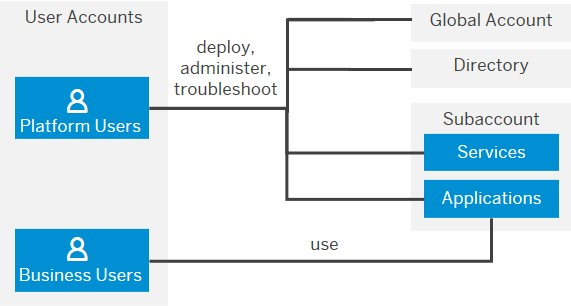

<!-- loio38ecf59cdda64150a102cfaa62d5faab -->

# Basic Platform Concepts

SAP BTP offers users the ability to turn data into business value, compose end-to-end business processes, and build and extend SAP applications quickly.

The services and solutions of SAP BTP are available on multiple cloud infrastructure providers. The **multi-cloud foundation** supports different environments, such as Cloud Foundry, ABAP, and Kyma, as well as multiple different regions, and a broad choice of programming languages.

The central point of entry to the cloud platform is the **SAP BTP cockpit**, where you can access your accounts and applications and manage all activities associated with them.

The figure below depicts the relationship between a global account, its subaccounts, environments, regions, entitlements, and quotas. It shows the administrative tasks to be considered at the global acccount level as well as at the subaccount level.

   
  
<a name="loio38ecf59cdda64150a102cfaa62d5faab__fig_cwb_2l1_mgb"/>Overview of Global Accounts and Subaccounts \(Feature Set A\)

 ") 

If your global account is on cloud management tools, feature set B, the account structure looks different. With feature set B, the new hierarchical element called **directory** is introduced, which is essentially a grouping of subaccounts. Furthermore, subaccounts can have multiple environments.

The figure below depicts the relationship between a global account, its directories, subaccounts, environments, regions, entitlements, and quotas for feature set B.

   
  
<a name="loio38ecf59cdda64150a102cfaa62d5faab__fig_edb_kg4_gnb"/>Overview of Global Accounts, Directories, and Subaccounts \(Feature Set B\)

 ") 

<table>
<tr>
<th valign="top">

Level

</th>
<th valign="top">

Administrative Tasks

</th>
</tr>
<tr>
<td valign="top">

Global Account

</td>
<td valign="top">

-   For each commercial model \(licence type\), you get a separate global account.

-   Appoint at least one person as administrator. The administrator is responsible for adding new subaccounts, adding members to a global account, and managing the entitlements. We recommend that you also appoint at least one substitute administrator. If the main administrator leaves the company or is unavailable, it's important that you have someone who's available to take over these tasks.

-   You purchase entitlements for each global account \(according to your commercial model\). The administrator of the global account distributes quotas to the individual subaccounts.

</td>
</tr>
<tr>
<td valign="top">

Directory \(optional, feature set B\)

</td>
<td valign="top">

-   Directories are only available with feature set B. See [Cloud Management Tools — Feature Set Overview](https://help.sap.com/viewer/65de2977205c403bbc107264b8eccf4b/Validation/en-US/caf4e4e23aef4666ad8f125af393dfb2.html "Cloud management tools represent the group of technologies designed for managing SAP BTP.") :arrow_upper_right:. They are groups of subaccounts that you can manage, operate, and analyze together.

-   Appoint at least one person as administrator. The administrator is responsible for adding new subaccounts, managing members, and managing entitlements. We recommend that you also appoint at least one substitute administrator. If the main administrator leaves the company or is unavailable, it's important that you have someone who's available to take over these tasks.

</td>
</tr>
<tr>
<td valign="top">

Subaccount

</td>
<td valign="top">

-   Each subaccount runs in exactly one region \(data center\) and one environment.

-   Appoint at least one person as administrator. The administrator is responsible for adding new members to the subaccount and assigning their business roles. We recommend that you also appoint at least one substitute administrator. If the main administrator leaves the company or is unavailable, it's important that you have someone who's available to take over these tasks.

</td>
</tr>
</table>

For more information, see [Account Model](basic-platform-concepts-38ecf59.md#loio730bdd6a9a6b46c4ae3c5bce3bea8e5c) and [Setting Up Your Account Model](../set-up-and-plan/setting-up-your-account-model-2db81f4.md).

 <a name="loioabaaf083a6574edc8ad30d9cd9a062f3"/>

<!-- loioabaaf083a6574edc8ad30d9cd9a062f3 -->

## Regions

You can deploy applications in different **regions**. Each region represents a geographical location \(for example, Europe, US East\) where applications, data, or services are hosted.

Regions are provided either by SAP or by our Infrastructure-as-a-Service \(IaaS\) partners Amazon Web Services \(AWS\), Microsoft Azure, Google Cloud, and Alibaba Cloud. The third-party region providers operate the infrastructure layer of the regions, whereas SAP operates the platform layer and Cloud Foundry. 

A region is chosen at the subaccount level. For each subaccount, you select exactly one region \(that is one data center\).

For more information, see [Regions](https://help.sap.com/viewer/65de2977205c403bbc107264b8eccf4b/Validation/en-US/350356d1dc314d3199dca15bd2ab9b0e.html "You can deploy applications in different regions. Each region represents a geographical location (for example, Europe, US East) where applications, data, or services are hosted.") :arrow_upper_right:.

<a name="loioabaaf083a6574edc8ad30d9cd9a062f3__section_select_region"/>

## Selecting a Region

When deciding on the location of your Platform as a Service \(PaaS\), consider existing Software as a Service \(SaaS\) and Infrastructure as a Service \(IaaS\) and try to locate it close to those or even in the same data center. You can also optimize application performance \(response time, latency\) by selecting a region that's geographically close to your users. However, the selection of a region is also dependent on many other factors: First, check the availability of specific services in the individual regions. Second, ensure that you comply with security requirements, such as country- or industry-specific data privacy regulations. And third, consider the location of other cloud offerings you’re using. You might have to locate your solutions in the same data center.

For a complete overview of the availability of services in the different regions, see [Services](https://discovery-center.cloud.sap/serviceCatalog).

 <a name="loio91d37e3e7ea8418d86c15078a352d70d"/>

<!-- loio91d37e3e7ea8418d86c15078a352d70d -->

## Environments

Environments constitute the actual platform-as-a-service offering of SAP BTP that allows for the development and administration of business applications. Environments are anchored in SAP BTP on subaccount level. 

Each environment comes equipped with specific tools, technologies, and runtimes that you need to build applications. So a multi-environment subaccount is your single address to host a variety of applications and offer diverse development options. One advantage of using different environments in one subaccount is that you only need to manage users, authorizations, and entitlements once per subaccount, and thus grant more flexibility to your developers.

SAP offers the following environments:

-   [Cloud Foundry Environment](https://help.sap.com/viewer/65de2977205c403bbc107264b8eccf4b/Validation/en-US/9c7092c7b7ae4d49bc8ae35fdd0e0b18.html#loio9c7092c7b7ae4d49bc8ae35fdd0e0b18 "The Cloud Foundry environment allows you to create polyglot cloud applications in Cloud Foundry. It contains the SAP BTP, Cloud Foundry runtime service, which is based on the open-source application platform managed by the Cloud Foundry Foundation.") :arrow_upper_right:

    The Cloud Foundry environment enables you to develop new business applications and business services, supporting multiple runtimes, programming languages, libraries, and services. You can leverage a multitude of buildpacks, including community innovations and self-developed buildpacks.

-   [ABAP Environment](https://help.sap.com/viewer/65de2977205c403bbc107264b8eccf4b/Validation/en-US/11d62652aa2b4600a0fa136de0789648.html "Within the Cloud Foundry environment, you can create a new space for ABAP development. This is what we refer to as the ABAP environment. It allows you to create extensions for ABAP-based products, such as SAP S/4HANA Cloud, and develop new cloud applications. You can transform existing ABAP-based custom code or extensions to the cloud.") :arrow_upper_right:

    Within the Cloud Foundry environment, you can create a new space for ABAP development. This is what we refer to as the ABAP environment. It allows you to create extensions for ABAP-based products, such as SAP S/4HANA Cloud, and develop new cloud applications. You can transform existing ABAP-based custom code or extensions to the cloud.

    To plan and set up your landscape and lifecycle management in the ABAP environment, see [ABAP Lifecycle Management](https://help.sap.com/viewer/65de2977205c403bbc107264b8eccf4b/Validation/en-US/5c7b17d68bb7427d93ff2086f01b2a55.html "") :arrow_upper_right:.

-   [Kyma Environment](https://help.sap.com/viewer/65de2977205c403bbc107264b8eccf4b/Validation/en-US/468c2f3c3ca24c2c8497ef9f83154c44.html#loio468c2f3c3ca24c2c8497ef9f83154c44 "Kyma environment provides a fully managed Kubernetes runtime based on the open-source project &quot;Kyma&quot;. This cloud-native solution allows developers to extend SAP solutions with serverless Functions and combine them with containerized microservices.") :arrow_upper_right:

    The Kyma environment is a fully managed Kubernetes runtime based on the open-source project "Kyma" that allows developers to extend SAP solutions with serverless functions and combine them with containerized microservices.

-   [Neo Environment](https://help.sap.com/viewer/65de2977205c403bbc107264b8eccf4b/Validation/en-US/0f79436cf43a4785bb5b7ee9dac0c76a.html "The Neo environment lets you develop HTML5, Java, and SAP HANA extended application services (SAP HANA XS) applications. You can also use the UI Development Toolkit for HTML5 (SAPUI5) to develop rich user interfaces for modern web-based business applications.") :arrow_upper_right:

    The Neo environment lets you develop HTML5, Java, and SAP HANA extended application services \(SAP HANA XS\) applications. You can also use the UI Development Toolkit for HTML5 \(SAPUI5\) to develop rich user interfaces for modern web-based business applications.

When you create subaccounts in a global account on feature set B, you can use different environments within the same subaccount: Choose multi-environment subaccounts to use Cloud Foundry, ABAP, and Kyma within the same subaccount. However, inside such a multi-environment subaccount, you cannot use Neo. To use Neo, you create a separate Neo subaccount. Neo cannot be combined with other environments in the same subaccount.

If you consider to create Neo subaccounts, see [Migrating from the Neo Environment to the Multi-Cloud Foundation (Cloud Foundry and Kyma)](https://help.sap.com/viewer/b017fc4f944e4eb5b31501b3d1b6a1f0/Cloud/en-US/aae4e0ae1cdf434b908c3c8cf3ea942a.html "Learn why and how to migrate your scenarios on SAP Business Technology Platform (SAP BTP) from the Neo environment to the multi-cloud foundation.") :arrow_upper_right: to learn about the Neo environment and the multi-cloud foundation.

<a name="loio91d37e3e7ea8418d86c15078a352d70d__section_brc_k2l_kpb"/>

## Environment Instances

To actually use an environment in a subaccount, you need to**enable** it by creating an instance of that environment. There are several ways to create **environment instances**:

-   Using the subaccount overview page in the cockpit: choose Enable.

-   Using the Service Marketplace tab in the cockpit: here you get more information, such as the available plans and links to further information.

-   Using the btp CLI command `btp create accounts/environment-instance`

**Related Information**  

[SAP BTP, Serverless Runtime](https://help.sap.com/viewer/product/XF_SERVERLESS_RUNTIME/Cloud/en-US)

[Consuming SAP BTP Services from Various Environments](https://help.sap.com/viewer/09cc82baadc542a688176dce601398de/Cloud/en-US/aa2ba1475dc943498a9d873af074821c.html)

 <a name="loio263d40009a5a4237a62e8f5c05ee641e"/>

<!-- loio263d40009a5a4237a62e8f5c05ee641e -->

## Commercial Models

SAP BTP offers two different commercial models for enterprise accounts.

-   **Consumption-based commercial model:** Your organization receives access to all current and future services that are eligible for this model. You have complete flexibility to turn services on and off and to switch between services as your business requires throughout the duration of your contract. This commercial model is available in two flavors: Cloud Platform Enterprise Agreement \(CPEA\) and Pay-As-You-Go for SAP BTP.

    For more information, see [What Is the Consumption-Based Commercial Model?](https://help.sap.com/viewer/65de2977205c403bbc107264b8eccf4b/Validation/en-US/7047eb4a15a84ac7be3c8612179e6d1f.html "With the consumption-based model, your organization purchases an entitlement to all current and future SAP BTP services that are eligible for this model. Throughout the duration of your contract, you have complete flexibility to turn services on and off and to switch between services as your business requires.") :arrow_upper_right:

-   **Subscription-based commercial model:** Your organization subscribes only to the services that you plan to use. You can then use these services at a fixed cost, irrespective of consumption.

    For more information, see [What Is the Subscription-Based Commercial Model?](https://help.sap.com/viewer/ea72206b834e4ace9cd834feed6c0e09/Cloud/en-US/96e78abc7f1c445e880346924441dc51.html#loio239b6e045e7e48f58b61655b02748d45 "Your organization receives a fixed price and period (typically a 1 to 3-year period) for access to your subscribed SAP BTP services.") :arrow_upper_right:

For information about service availability, prices, and estimators, see [https://www.sap.com/products/extension-suite/pricing.html](https://www.sap.com/products/extension-suite/pricing.html) and [https://www.sap.com/products/integration-suite/pricing.html](https://www.sap.com/products/integration-suite/pricing.html). You can also view the service catalog via the [SAP Discovery Center](https://discovery-center.cloud.sap).

> ### Note:  
> You can use both commercial models, either in separate global accounts or in the same global acccount depending on your business needs. Contact your SAP account executive or sales representative for more information.

  

 <a name="loio730bdd6a9a6b46c4ae3c5bce3bea8e5c"/>

<!-- loio730bdd6a9a6b46c4ae3c5bce3bea8e5c -->

## Account Model

The SAP BTP cockpit is structured according to global accounts, directories, and subaccounts.

<a name="loio730bdd6a9a6b46c4ae3c5bce3bea8e5c__section_z22_xcr_32b"/>

## Global Accounts

A **global account** is the realization of a contract you or your comaony made with SAP.

A global account is used to manage subaccounts, members, entitlements and quotas. You receive entitlements and quotas to use platform resources per global account and then distribute the entitlements and quotas to the subaccount for actual consumption. There are two types of commercial models for global accounts: consumption-based model and subscription-based model. See [Commercial Models](basic-platform-concepts-38ecf59.md#loio263d40009a5a4237a62e8f5c05ee641e) .

Global accounts are region- and environment-independent. Within a global account, you manage all of your subaccounts, which in turn are specific to one region.

SaaS applications are usually displayed in a separate global account.

> ### Note:  
> The following features, **directories** and **labels**, are only available if your global account is on feature set B. For more information, see [Cloud Management Tools — Feature Set Overview](https://help.sap.com/viewer/65de2977205c403bbc107264b8eccf4b/Validation/en-US/caf4e4e23aef4666ad8f125af393dfb2.html "Cloud management tools represent the group of technologies designed for managing SAP BTP.") :arrow_upper_right:.

<a name="loio730bdd6a9a6b46c4ae3c5bce3bea8e5c__section_m4y_bh4_2nb"/>

## Directories

**Directories** allow you to organize and manage your subaccounts according to your technical and business needs.

A directory can contain directories and subaccounts to create a hierarchy. Using directories to group other directories and subaccounts is optional - you can still create subaccounts directly under your global account.

You can create a hierarchical structure that is 7 levels deep. The highest level of a given path is always the global account and the lowest is a subaccount, which means that you can have up to 5 levels of directories.

Directories allow you to:

-   Group and filter directories and subaccounts

-   Monitor usage and costs for contracts that use the consumption-based commercial model

In addition, you can also add the following features to your directories \(optional\):

-   Manage Entitlements: Enables the assignment of a quota for services and applications to the directory from the global account quota for distribution to the directory's subaccounts.

    When you assign entitlements to a directory, you express the entitlements and maximum quota that can be distributed across its children subaccounts. You also have the option to choose the auto-assignment of a set amount of quota to all subaccounts created or moved to that directory. Subaccounts that are already in the directory when you select that option will not be auto-assigned quota.

-   Manage Authorizations: Enables a custom identity provider and/or authorization management for the directory. For example, it allows certain users to manage directory entitlements. You can only use this feature in combination with the *Manage Entitlements* feature.

<a name="loio730bdd6a9a6b46c4ae3c5bce3bea8e5c__section_kv3_whb_gnb"/>

## Labels

Labels are user-defined words or phrases that you can assign to various entities in SAP BTP to categorize them in your global account, to identify them more easily. They let you organize and filter your directories, subaccounts, instances and subscriptions within your global account.

For more information, see [Labels [Feature Set B]](https://help.sap.com/viewer/65de2977205c403bbc107264b8eccf4b/Validation/en-US/8ed4a705efa0431b910056c0acdbf377.html#loioe8663c08ead648faa673b0d63c5b478e "Labels are user-defined words or phrases that you can assign to various entities in SAP BTP to categorize them in your global account, to identify them more easily.") :arrow_upper_right:.

<a name="loio730bdd6a9a6b46c4ae3c5bce3bea8e5c__section_cmv_ycr_32b"/>

## Subaccounts

**Subaccounts** let you structure a global account according to your organization’s and project’s requirements with regard to members, authorizations, and entitlements.

A global account can contain one or more subaccounts in which you deploy applications, use services, and manage your subscriptions. Subaccounts in a global account are independent from each other. This is important to consider with respect to security, member management, data management, data migration, integration, and so on, when you plan your landscape and overall architecture.

Each subaccount is associated with a region, which is the physical location where applications, data, or services are hosted. The specific region is relevant when you deploy applications and access the SAP BTP cockpit using the corresponding cockpit URL. The region assigned to your subaccount doesn't have to be directly related to your location. You could be located in the United States, for example, but operate your subaccount in Europe.

The entitlements and quotas that have been purchased for a global account have to be assigned to the individual subaccounts.

Global accounts and subaccounts are completely independent of user accounts. For more information, see [User and Member Management](https://help.sap.com/viewer/65de2977205c403bbc107264b8eccf4b/Validation/en-US/cc1c676b43904066abb2a4838cbd0c37.html "On the cloud platform, member management happens at all levels from global account to space, while user management is done for deployed applications.") :arrow_upper_right:.

**Relationship between Subaccounts, Orgs, and Spaces**

When you enable the Cloud Foundry environment in one of your subaccounts, the system automatically creates a Cloud Foundry org for you. The subaccount and the org have a 1:1 relationship and the same navigation level in the cockpit \(even though they may have different names\). You can create spaces within that Cloud Foundry org. Spaces let you further break down your account model and use services and functions in the Cloud Foundry environment.

For more information about Cloud Foundry orgs and spaces, see the Cloud Foundry documentation at [https://docs.cloudfoundry.org/concepts/roles.html](https://docs.cloudfoundry.org/concepts/roles.html).

For more information, see

-   [Account Model](https://help.sap.com/viewer/65de2977205c403bbc107264b8eccf4b/Validation/en-US/8ed4a705efa0431b910056c0acdbf377.html#loio8ed4a705efa0431b910056c0acdbf377 "Learn more about the different types of accounts on SAP BTP and how they relate to each other.") :arrow_upper_right:

-   [Managing Global Accounts Using the Cockpit](https://help.sap.com/viewer/65de2977205c403bbc107264b8eccf4b/Validation/en-US/667f34ba9222450491c2b848cd17e189.html "Your SAP BTP global account is the entry point for managing the resources, landscape, and entitlements for your departments and projects in a self-service manner.") :arrow_upper_right:

-   [Managing Directories Using the Cockpit [Feature Set B]](https://help.sap.com/viewer/ea72206b834e4ace9cd834feed6c0e09/Cloud/en-US/f495ac1a62684affbff9f2629fe58bb0.html "Learn how to organize and manage your subaccounts according to your technical and business needs by using directories in the SAP BTP cockpit.") :arrow_upper_right:

-   [Managing Subaccounts Using the Cockpit](https://help.sap.com/viewer/ea72206b834e4ace9cd834feed6c0e09/Cloud/en-US/55d0b6d8b96846b8ae93b85194df0944.html "Learn how to structure a global account according to your organization’s and project’s requirements with regard to members, authorizations, and entitlements by managing subaccounts.") :arrow_upper_right:

-   [Setting Up Your Account Model](../set-up-and-plan/setting-up-your-account-model-2db81f4.md)[Setting Up Your Account Model](../set-up-and-plan/setting-up-your-account-model-2db81f4.md)

 <a name="loioc9c9dd2686354c67939bbc20d541f597"/>

<!-- loioc9c9dd2686354c67939bbc20d541f597 -->

## User and Member Management

On the cloud platform, member management happens at all levels from global account to space, while user management is done for deployed applications.

**User accounts** enable users to log on to SAP BTP and access subaccounts and use services according to the permissions given to them. We distinguish between two types of users:

-   **Platform users** are usually developers, administrators or operators who deploy, administer, and troubleshoot applications and services on SAP BTP.

-   **Business users** use the applications that are deployed to SAP BTP. For example, the end users of your deployed application or users of subscribed apps or services, such as SAP Business Application Studio or SAP Web IDE, are business users.

**Member management** refers to managing permissions for platform users. A member is a user who is assigned to an SAP BTP global account or subaccount. Administrators can add users to global accounts and subaccounts and assign roles to them as needed. You can use predefined roles, for example the administrator role for managing subaccount members.

**User management** refers to managing authentication and authorization for your business users. This is only done for your deployed applications.

For more information, see [User and Member Management](https://help.sap.com/viewer/65de2977205c403bbc107264b8eccf4b/Validation/en-US/cc1c676b43904066abb2a4838cbd0c37.html "On the cloud platform, member management happens at all levels from global account to space, while user management is done for deployed applications.") :arrow_upper_right:.

 <a name="loio363f0f68f9704830ac65c87a2562559b"/>

<!-- loio363f0f68f9704830ac65c87a2562559b -->

## Entitlements and Quotas

When you purchase an enterprise account, you’re entitled to use a specific set of resources, such as the amount of memory that can be allocated to your applications.

-   On SAP BTP, all external dependencies such as databases, messaging systems, files systems, and so on, are **services**. In this context, multitenant applications and environments are considered services.

    Each service has one or more **service plans** available. A service plan is the representation of the costs and benefits for a given variant of a particular service. For instance, a database may be configured with various "T-shirt sizes", each of which is a different service plan.

-   An **entitlement** is your right to provision and consume a resource. In other words, entitlements are **the service plans** that you're entitled to use.

-   A **quota** represents the numeric quantity that defines the maximum allowed consumption of a resource. In other words, **how much** of a service plan you're entitled to use.

-   Entitlements are either managed at subaccount or directory level.

For more information, see [Entitlements and Quotas](https://help.sap.com/viewer/65de2977205c403bbc107264b8eccf4b/Validation/en-US/00aa2c23479d42568b18882b1ca90d79.html "When you purchase an enterprise account, you’re entitled to use a specific set of resources, such as the amount of memory that can be allocated to your applications.") :arrow_upper_right: and [Managing Entitlements and Quotas Using the Cockpit](https://help.sap.com/viewer/65de2977205c403bbc107264b8eccf4b/Validation/en-US/c8248745dde24afb91479361de336111.html "When you purchase an enterprise account, you are entitled to use a specific set of resources, such as the amount of memory that can be allocated to your applications.") :arrow_upper_right:.

 <a name="loio860a4d65945b4ca3a757be079d6825e5"/>

<!-- loio860a4d65945b4ca3a757be079d6825e5 -->

## Capabilities and Services

SAP BTP offers fast in-memory processing, sustainable, agile **solutions** and **services** to integrate data and extend applications, and fully embedded analytics and intelligent technologies. 

 **Services** enable, facilitate, or accelerate the development of business applications and other platform services on SAP BTP. 

For a complete list of services and capabilities, see [Services](https://discovery-center.cloud.sap/serviceCatalog).

For more information, see [Solutions and Services](https://help.sap.com/viewer/65de2977205c403bbc107264b8eccf4b/Validation/en-US/7613d9ce711e1014839a8273b0e91070.html#loio7613d9ce711e1014839a8273b0e91070 "Consume the solutions and services by SAP BTP according to your preferred development environment and use cases.") :arrow_upper_right:.

