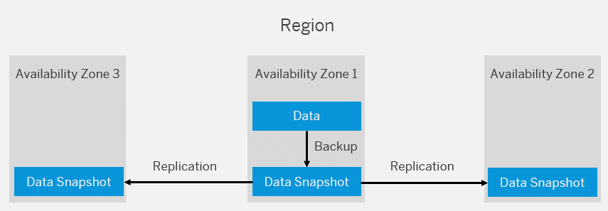

<!-- loio7821fcf6f0cc487799fb6b75e8d0e0f7 -->

# Configuring Backup

Backup and recovery of data stored in the following services are performed by SAP. For other services, you can follow our best practices to back up your configurations.

 <a name="loio6c1e071845dd4db2829b413a05154a7c"/>

<!-- loio6c1e071845dd4db2829b413a05154a7c -->

## Data Backups Managed by SAP

SAP handles the backup and recovery of service data. However, there are some exceptions.

<a name="loio6c1e071845dd4db2829b413a05154a7c__section_wg4_p1m_r4b"/>

## Services with Automated Data Backups

Data stored in the following services is automatically backed up by SAP:

-   **SAP HANA Cloud**: SAP HANA Cloud instances are continually backed up to safeguard your database and ensure that it can be recovered. For more information, see [Backup and Recovery](https://help.sap.com/viewer/db19c7071e5f4101837e23f06e576495/2020_04_QRC/en-US/89d71f01daca4ecaaa069d6a060167f5.html).

-   **PostgreSQL on SAP BTP, Hyperscaler Option**: SAP keeps backups of your PostgreSQL database instances for a retention period of 14 days. You can restore a database instance to any point in time within the backup retention period by creating a new database instance. For more information, see [Restore Database Instance to a Specified Time](https://help.sap.com/viewer/b3fe3621fa4a4ed28d7bbe3d6d88f036/Cloud/en-US/724c9112ed5a48c59c8e88f17290550d.html).

-   **SAP BTP, Kyma environment**: The Kyma environment relies on managed Kubernetes clusters for periodic backups of Kubernetes objects. For more information, see [Kyma Environment Backup](https://help.sap.com/viewer/65de2977205c403bbc107264b8eccf4b/Cloud/en-US/ab959cfbd07b46af97aecfd6577bfb10.html).

Data stored using these services and components is fully backed up on a regular basis. For services running in the SAP BTP, Cloud Foundry environment, the backed-up data is copied to additional availability zones within the same region. Each availability zone represents a physically separate location with its own power supply, network, and cooling. For more information, see [Regions](https://help.sap.com/viewer/65de2977205c403bbc107264b8eccf4b/Cloud/en-US/350356d1dc314d3199dca15bd2ab9b0e.html).

For services running in the SAP BTP, Neo environment, the backed-up data is copied to an availability zone in another region. For more information, see [Regions in the Neo Environment](https://help.sap.com/viewer/ea72206b834e4ace9cd834feed6c0e09/Cloud/en-US/21c30a4e491544fc927ecf3a5857c54e.html).

<a name="loio6c1e071845dd4db2829b413a05154a7c__section_dbc_r1m_r4b"/>

## Services Without Automated Data Backups

The following services don’t currently provide any backup and restore features:

-   **Redis on SAP BTP, hyperscaler option**: This service doesn’t support persistence.

-   **Object Store on SAP BTP**: There's no backup and restore feature provided by the Object Store service. However, there are additional features that could help in backup and restore in certain scenarios:
    -   [Object Versioning](https://help.sap.com/viewer/2ee77ef7ea4648f9ab2c54ee3aef0a29/Cloud/en-US/787fbe77f4eb46e0ae9a6222d57ba50e.html) allows you to recover from accidental deletion and modification of objects because the hyperscalers keep older versions in case the objects are modified or deleted.

    -   [Object Expiration Rules](https://help.sap.com/viewer/2ee77ef7ea4648f9ab2c54ee3aef0a29/Cloud/en-US/52e2c18af86c45e2b1495cd594602304.html) helps with the automatic deletion of older versions.

    -   The **prevent deletion** feature helps preventing your blob stores from accidental deletion. For more information, see:

        -   [Prevent Accidental Deletion of AWS S3 Buckets](https://help.sap.com/viewer/2ee77ef7ea4648f9ab2c54ee3aef0a29/Cloud/en-US/8c3c66da50364e0bafb994f4c4b57042.html)

        -   [Preventing Accidental Deletion of Azure Containers](https://help.sap.com/viewer/2ee77ef7ea4648f9ab2c54ee3aef0a29/Cloud/en-US/67e5ba7dae7749c88483b8a3fe395eff.html)

 <a name="loio9de0caa8abe34f4897e5b727868019c0"/>

<!-- loio9de0caa8abe34f4897e5b727868019c0 -->

## Service Configurations Managed by Customers

SAP doesn't manage backups of service configurations. However, you can back up your service-specific configuration yourself. This backup allows you to restore your configuration in case it’s deleted by accident.

<a name="loio9de0caa8abe34f4897e5b727868019c0__section_u5q_mbm_r4b"/>

## Services with User-Specific Configurations

Different configurations can be backed up, depending on your specific service. Here are some examples:

-   **SAP Connectivity service**

    -   You can back up your Cloud Connector configuration. For more information, see [Configuration Backup](https://help.sap.com/viewer/b865ed651e414196b39f8922db2122c7/Cloud/en-US/abd1ba7cb0dd484aa24f0f6bed29f3fa.html "You can backup and restore your Cloud Connector configuration.") :arrow_upper_right:.

    -   You can back up your destination configuration. For more information, see [Export Destinations](https://help.sap.com/viewer/cca91383641e40ffbe03bdc78f00f681/Cloud/en-US/707b49e752df4741bf678bc27523af7a.html "Export destinations from the Destinations editor in the SAP BTP cockpit to backup or reuse a destination configuration.") :arrow_upper_right:.

    -   You can back up your X.509 certificates. For more information, see [Set up Trust Between Systems](https://help.sap.com/viewer/cca91383641e40ffbe03bdc78f00f681/Cloud/en-US/82dbecae3454493782d16a79e30f1a6d.html "Download and configure X.509 certificates as a prerequisite for user propagation from the Cloud Foundry environment.") :arrow_upper_right:.

-   **Process Visibility capability within the SAP Workflow Management service**: You can back up your visibility scenarios. For more information, see [Export a Scenario](https://help.sap.com/viewer/62fd39fa3eae4046b23dba285e84bfd4/Cloud/en-US/27f76c0dd1534ca0980706f7d72d86a1.html).

-   **SAP Authorization and Trust Management service**: You can back up your configurations with the [SAP Authorization and Trust Management service API package](https://api.sap.com/package/authtrustmgmnt?section=Artifacts) available on the [SAP API Business Hub](https://api.sap.com/). The configurations include:

    -   Roles. You can back up role configurations with the [Authorization](https://api.sap.com/api/AuthorizationAPI/overview) API.

    -   Role collections and role collection assignments. You can back up configurations for role collections and role collection assignments with the [System for Cross-domain Identity Management \(SCIM\)](https://api.sap.com/api/PlatformAPI/resource) API.

    -   Identity provider configurations. You can back up identity provider configurations with the [Identity Provider Management](https://api.sap.com/api/TrustConfigurationAPI/overview) API.

-   **SAP Cloud Integration**: You can back up keystore entries. For more information, see [Backing Up Keystore Entries](https://help.sap.com/viewer/368c481cd6954bdfa5d0435479fd4eaf/Cloud/en-US/b8e03b7f25264dea8f6cec4a8316d634.html).

-   **SAP Alert Notification service for SAP BTP**: You can back up your subscriptions, conditions, and actions. For more information, see [Exporting or Importing Configurations](https://help.sap.com/viewer/5967a369d4b74f7a9c2b91f5df8e6ab6/Cloud/en-US/771da5b383ee4722afc4eb1f58aa4648.html).

If your service has configurations that can be backed up, you can find more details in the **Administration** section of your service documentation. This section provides links to detailed instructions on how to back up and restore your configurations.

<a name="loio9de0caa8abe34f4897e5b727868019c0__section_h4l_4bm_r4b"/>

## Services Without User-Specific Configurations

There's no backup for user-specific configurations available for the following services:

-   **SAP HTML5 Application Repository service for SAP BTP**

-   **Identity Authentication service**

-   **Identity Provisioning service**

-   **SAP Credential Store service**

-   **Workflow capability within the SAP Workflow Management service**

-   **SAP Audit Log service**

-   **SAP Application Logging service for SAP BTP**

