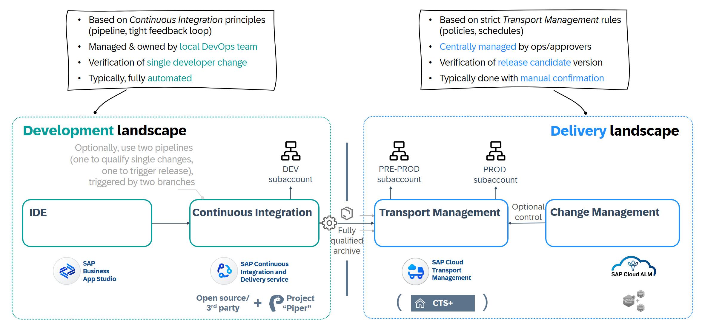

<!-- loiob39bae31d35d4d039431973116363d57 -->

# Delivering Applications

In enterprise environments, use a managed and automated delivery approach – because it is less error-prone and creates repeatable outcomes. Furthermore, you can apply governance and central control of the propagation of your changes towards your production environment.

<a name="loiob39bae31d35d4d039431973116363d57__section_fgy_dl1_dxb"/>

## Overview

You have several options for propagating developed applications and application-specific content from one subaccount to another automatically and with more control; for example, from your Development or Testing to your Production subaccounts.

The delivery approaches are based on some of the concepts and approaches as outlined in [Deploying Applications](deploying-applications-866ab13.md#loio866ab13d5f8e48cdaac6d70e55e76e09).

The following table presents the delivery options, with tool support and automation decreasing from top to bottom:

<table>
<tr>
<th valign="top">

Delivery Option

</th>
<th valign="top">

Development Content \(such as Java, HTML5, CAP applications\)

</th>
<th valign="top">

SAP Cloud Integration Content

</th>
<th valign="top">

SAP HANA Cloud Artifacts

</th>
<th valign="top">

SAP Build Work Zone

</th>
<th valign="top">

Other App-Specific Content

</th>
<th valign="top">

Kyma-Based Apps

</th>
</tr>
<tr>
<td valign="top">

SAP Continuous Integration and Delivery \(CI/CD\)

</td>
<td valign="top">

recommended

</td>
<td valign="top">

Basic pipeline available, still in development

</td>
<td valign="top">

recommended

</td>
<td valign="top">

n/a

</td>
<td valign="top">

n/a

</td>
<td valign="top">

recommended \(automating the packaging into a Dockerfile, and the deployment\)

</td>
</tr>
<tr>
<td valign="top">

SAP Cloud Transport Management with the option to integrate into Change Management\*

</td>
<td valign="top">

recommended \(as MTA\)

</td>
<td valign="top">

recommended \(as MTA\)

</td>
<td valign="top">

recommended \(as MTA\)

</td>
<td valign="top">

recommended

</td>
<td valign="top">

recommended

</td>
<td valign="top">

n/a

</td>
</tr>
<tr>
<td valign="top">

CTS+ with the option to integrate into Change Management\*

</td>
<td valign="top">

recommended \(as MTA\)

</td>
<td valign="top">

recommended \(as MTA\)

</td>
<td valign="top">

recommended \(as MTA\)

</td>
<td valign="top">

n/a

</td>
<td valign="top">

n/a

</td>
<td valign="top">

n/a

</td>
</tr>
<tr>
<td valign="top">

Manually

</td>
<td valign="top" colspan="6">

For more information, see [Deploying Applications](deploying-applications-866ab13.md#loio866ab13d5f8e48cdaac6d70e55e76e09).

</td>
</tr>
</table>

\* SAP Cloud ALM change and deployment management, and SAP Solution Manager Change Request Management and Quality Gate Management

<a name="loiob39bae31d35d4d039431973116363d57__section_s12_tm1_dxb"/>

## Delivery Options

> ### Recommendation:  
> **For Cloud Foundry**, use continuous integration together with transport management, to combine agility with control:
> 
> -   Your development team can benefit from the highly automated CI process that automatically qualifies their changes after submitting them to the source code repository. Also, this approach makes sure that only qualified changes are considered for propagation towards your production environment. Especially with SAP Continuous Integration and Delivery, you can drastically reduce the cognitive load of your development teams.
> 
> -   Still, you can benefit from additional control for the propagation of your changes towards your production environment, where you centrally define delivery landscapes and configure who is allowed to handle changes where, which is required in most enterprise environments and regulated markets. Also, you get the option to integrate into new or existing change management processes, such as offered by SAP Cloud ALM – to synchronize transport of changes in hybrid scenarios.
> 
> -   If you're not facing the \(immediate\) need for more control, SAP recommends starting with SAP Continuous Integration and Delivery, if it covers your development scenario. You can easily activate the automated hand-over into transport management at a later point in time. For example, you could perform direct deployment from the pipeline during a proof of concept, but then integrate into transport management when the team comes up with a release candidate.
> 
> 
> **For Kyma**, use a CI/CD pipeline to package your application into a Docker image and the corresponding deployment. For this, create [Helm charts](https://helm.sh/docs/topics/charts/) that you can link to your pipeline. This way, you can benefit from automation and a higher reliability. Start with the corresponding pipeline template of SAP Continuous Integration and Delivery. Only if you need more sophisticated pipelines and delivery landscapes, consider building your own pipeline with [Project "Piper"](https://sap.github.io/jenkins-library/).

To learn more about the delivery options, expand the sections:

### SAP Continuous Integration and Delivery \(CI/CD\)

With CI/CD, you can automatically qualify development changes every time they're submitted to your central Git-based source code repository. For this, you configure “pipelines”, which are triggered directly by commits, and then automatically build, test, and deploy your code changes. This approach speeds up your development and delivery cycles. Your development team gets direct feedback on the quality of performed changes, and you can make sure that only qualified changes are considered for propagation towards your production environment.

SAP offers two main approaches for applying CI/CD in your software development. Depending on your expertise in CI/CD, the required level of flexibility, the infrastructure you bring \(or don’t bring\) along, and the desired level of support, choose one of the following options:

**SAP Solutions for Continuous Integration and Delivery**

<table>
<tr>
<th valign="top">

CI/CD Solution

</th>
<th valign="top">

Required Expertise in CI/CD

</th>
<th valign="top">

Level of Flexibility

</th>
<th valign="top">

Infrastructure

</th>
<th valign="top">

Support

</th>
</tr>
<tr>
<td valign="top">

**[SAP Continuous Integration and Delivery](https://help.sap.com/docs/CONTINUOUS_DELIVERY)** 

</td>
<td valign="top">

Low

</td>
<td valign="top">

Medium

</td>
<td valign="top">

SAP Continuous Integration and Delivery is ready to use and doesn’t need a separate CI/CD infrastructure.

</td>
<td valign="top">

Support provided by SAP

</td>
</tr>
<tr>
<td valign="top">

**[Project "Piper"](https://sap.github.io/jenkins-library/)** \(complemented by [Continuous Integration and Delivery Best Practices Guide](https://help.sap.com/docs/CICD_OVERVIEW/3324745951b44b578bd65221d2ff8f9a/1ae37c7c7ad343589e2bd2fd424c9105.html) 

</td>
<td valign="top">

Medium - high

</td>
<td valign="top">

Medium - high

</td>
<td valign="top">

Project "Piper" is an open-source project that provides preconfigured Jenkins pipelines, which you can use in your own Jenkins infrastructure and adapt according to your needs, if necessary. Project "Piper" needs Jenkins as the underlying CI/CD infrastructure. If you don’t have a Jenkins instance yet, use the Cx Server to bootstrap a preconfigured one, or use the step library and the Continuous Integration and Delivery Best Practices Guide to build your own pipelines on any CI/CD infrastructure. See [Getting Started with Project "Piper"](https://www.project-piper.io/guidedtour/).

</td>
<td valign="top">

Open Source community and SAP Community support \(no direct support by SAP\)

</td>
</tr>
</table>

So, with the out-of-the-box pipeline templates for typical SAP development use cases, SAP Continuous Integration and Delivery targets rather typical SAP customers and partners with an ABAP background that are transitioning into the cloud, while Project 'Piper' offers full flexibility for experienced users with their own CI/CD stack and a high level of expertise.

SAP Continuous Integration and Delivery offers pipeline templates for SAP BTP Cloud Foundry and Kyma, and for the deployment of SAP Fiori apps on ABAP front-end servers.

For more information, see [SAP Solutions for Continuous Integration and Delivery](https://help.sap.com/viewer/8cacec64ed854b2a88e9a0973e0f97a2/Cloud/en-US/e9fa320181124fa9808d4446a1bf69dd.html) and [Which SAP Solution for CI/CD Meets Your Needs?](https://help.sap.com/viewer/8cacec64ed854b2a88e9a0973e0f97a2/Cloud/en-US/e9fa320181124fa9808d4446a1bf69dd.html#loioa49d1ba1ecef4e9d96deffd127c4522d).

### Transport Management

If you want to have more control, especially when propagating changes towards your production environment, consider transport and change management: You can centrally define and manage delivery landscapes and configure who can come up and handle deliveries on which transport node. Also, with a combination of transport and change management, you can set up synchronized transports in hybrid scenarios \(involving both on-premise ABAP content and SAP BTP content\). For more information, see [Interplay of SAP Cloud Platform Transport Management, CTS+ and ChaRM in hybrid landscapes](https://community.sap.com/t5/technology-blogs-by-sap/interplay-of-sap-cloud-platform-transport-management-cts-and-charm-in/ba-p/13428863).

For transport management, SAP BTP offers the following :

-   For cloud transports, also in hybrid landscapes: the **SAP Cloud Transport Management** service, with which you can centrally transport development content archives, delivery units of SAP HANA XS classic model, and application-specific content of SAP cloud solutions, such as SAP Cloud Integration content, between different subaccounts. Such subaccounts might even belong to different global accounts, spread across different regions. For more information, see [What is SAP Cloud Transport Management](https://help.sap.com/viewer/7f7160ec0d8546c6b3eab72fb5ad6fd8/Cloud/en-US)

    > ### Recommendation:  
    > Use SAP Cloud Transport Management to handle SAP BTP development and application-specific content, independent of whether it's provided as multitarget application \(MTA\) files or in other formats.

    To facilitate role management and allow strict access control, we recommend running SAP Cloud Transport Management as shared service, by setting it up on a central administrative subaccount. For providing its service, SAP Cloud Transport Management works then together with agents running in source and target accounts, such as SAP Content Agent service in the SAP BTP, Cloud Foundry runtime. SAP Content Agent service eases the local management of application-specific content by offering export/import and content assembly - interplaying with central transport and change management capabilities or used standalone via its own user interface. For more information, see [Introduction to SAP Content Agent Service](https://help.sap.com/docs/content-agent-service/user-guide/introduction?version=Cloud).

-   For on-premise focused scenarios: the **enhanced Change and Transport System \(CTS+\)**, running in an on-premise ABAP system. Besides handling the transport of on-premise systems, CTS+ also lets you transport SAP BTP artifacts from one subaccount to another. Note that the artifacts must be packaged as multitarget application \(MTA\) archives; no other SAP BTP content format is planned to be supported by CTS+. Therefore, only consider CTS+ for SAP BTP content, if you have CTS+ already in use and only have to handle MTA-based content on SAP BTP \(today and in the future\). For more information, see [Transporting Multitarget Applications with CTS+](https://help.sap.com/viewer/ea72206b834e4ace9cd834feed6c0e09/Cloud/en-US/f598f69a9be347029b7e5e7205fc7d1f.html "You can enable transport of SAP BTP applications and application content that is available as Multitarget Applications (MTA) using the Enhanced Change and Transport System (CTS+).") :arrow_upper_right:

    > ### Recommendation:  
    > As a future-proof way forward, to be able to cover also more and more application-specific content with one central approach, SAP recommends SAP Cloud Transport Management.

You can integrate transport management with change management in SAP Cloud ALM and SAP Solution Manager:

-   For information about integration of SAP Cloud Transport Management with SAP Cloud ALM, see [SAP Cloud Transport Management Service](https://help.sap.com/docs/cloud-alm/setup-administration/cloud-transport-management?locale=en-US). If you want to benefit from change and deployment management capabilities of SAP Cloud ALM for SAP BTP changes, integrate a standalone instance of SAP Cloud Transport Management, running in one of your subaccounts. For more information, see [New Integration of SAP Cloud Transport Management and SAP Cloud ALM](https://community.sap.com/t5/technology-blogs-by-sap/new-integration-of-sap-cloud-transport-management-and-sap-cloud-alm/ba-p/13728049).

-   For integration into change management approaches around SAP Solution Manager, you have the choice: Either run CTS+ centrally on SAP Solution Manager and integrate it with change management tools, such as Change Request Management or Quality Gate Management – or integrate SAP Cloud Transport Management into these tools running on SAP Solution Manager \(minimum version: SAP Solution Manager 7.2 SP10\). You can even use CTS+ and SAP Cloud Transport Management in parallel within Change Request Management or Quality Gate Management.

    With these approaches, you can set up synchronized transports in hybrid scenarios \(involving both on-premise ABAP content and SAP BTP content\). For more information, see [Interplay of SAP Transport Management, CTS+ and ChaRM in hybrid landscapes](https://blogs.sap.com/2020/01/31/interplay-of-sap-cloud-platform-transport-management-cts-and-charm-in-hybrid-landscapes/)

### CI/CD with Transport Management

In Cloud Foundry, combine CI/CD with transport management \(either in the form of SAP Cloud Transport Management service or CTS+\), to gain more control over the delivery of release candidates towards your production environment and at the same time benefit from the agility CI/CD brings to your development. For more information, see [How to integrate SAP Transport Management into your CI/CD pipeline](https://blogs.sap.com/2019/08/20/how-to-integrate-sap-cloud-platform-transport-management-into-your-cicd-pipeline/). It's also possible to combine CI/CD, CTS+, SAP Cloud Transport Management, and change management. If you use SAP Continuous Integration and Delivery, you can define an automated hand-over from your pipeline into SAP Cloud Transport Management out-of-the-box.

### Manually

-   **Deploy applications manually** from your IDE to different subaccounts. Import or export your application using the SAP BTP cockpit, or use the Cloud Foundry command-line interface to deploy your application. For details, see [Deploying Applications](deploying-applications-866ab13.md#loio866ab13d5f8e48cdaac6d70e55e76e09).

    > ### Note:  
    > You can transport portal settings and configurations only by manually redeploying your application in each subaccount.

-   \(HTML5 applications only\) **Synchronize Git repositories** and create build scripts that let you transfer commits from the repository of the source subaccount to the repository of the target subaccount. After the synchronization, you must still deploy the application manually using the SAP BTP cockpit.
-   \(SAP HANA XS applications only\) Use the **SAP HANA XS Application Lifecycle Management \(HALM\)** to create transport routes between two SAP HANA systems, then transport delivery units between those systems. For more information, see [SAP HANA Application Lifecycle Management](https://help.sap.com/viewer/52715f71adba4aaeb480d946c742d1f6/2.0.03/en-US/9a012d6438764459a581e6af55a87c46.html).

**Related Information**  

[Blog Post: Transport Approaches in SAP BTP](https://blogs.sap.com/2017/06/30/part-6-transport-approaches-in-sap-cp/)

[Blog Post: Getting started with the predefined CI/CD pipeline for Kyma runtime](https://community.sap.com/t5/technology-blogs-by-sap/getting-started-with-the-predefined-ci-cd-pipeline-for-kyma-runtime/ba-p/13525740)

[Blog Post: Cloud Native Buildpack Support in SAP Continuous Integration and Delivery](https://community.sap.com/t5/technology-blogs-by-sap/wishes-come-true-cloud-native-buildpack-support-in-sap-continuous/ba-p/13578382)

<a name="loio13359fede8e0422e885d86fbea3a3c38"/>

<!-- loio13359fede8e0422e885d86fbea3a3c38 -->

## Example: Deliver a Multi-Target Application Using Continuous Integration and Transport Management

When developing applications for SAP BTP, you can combine the agility of continuous integration with the control of transport management.

1.  You create the application with the IDE of your choice, for example SAP Business Application Studio. The artifacts are stored in a central source code repository.

2.  Whenever a developer commits a change to the source code repository, a continuous integration pipeline starts.

    > ### Recommendation:  
    > For typical SAP BTP scenarios, such as development with SAP Cloud Application Programming Model, we recommend using SAP Continuous Integration and Delivery. The pipeline templates contain steps to build the application, run automated tests, and deploy the application to your development subaccount.

3.  In the “release” stage of the pipeline, you can also hand over the MTA to SAP Cloud Transport Management.

    This creates a transport request, which can then be handled according to your governance requirements.

    > ### Recommendation:  
    > We recommend this step only for qualified release candidates of your application. This can be achieved by using a separate release pipeline, for example.

4.  Optionally, you can integrate SAP Cloud Transport Management with SAP Cloud ALM or SAP Solution Manager. With that, you can manage hybrid projects, including SAP BTP and on-premise parts.

**Related Information**  

[Continuous Integration and Delivery Best Practices Guide](https://help.sap.com/docs/CICD_OVERVIEW/3324745951b44b578bd65221d2ff8f9a/1ae37c7c7ad343589e2bd2fd424c9105.html)

[Transporting Multitarget Applications with CTS+](https://help.sap.com/viewer/ea72206b834e4ace9cd834feed6c0e09/Cloud/en-US/f598f69a9be347029b7e5e7205fc7d1f.html "You can enable transport of SAP BTP applications and application content that is available as Multitarget Applications (MTA) using the Enhanced Change and Transport System (CTS+).") :arrow_upper_right:

