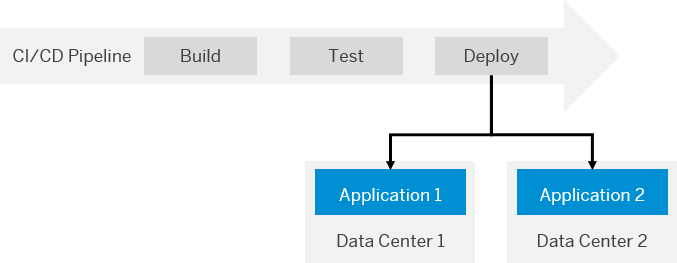

<!-- loioe6d2bdb006734bd69e394379ff0dd956 -->

<link rel="stylesheet" type="text/css" href="../css/sap-icons.css"/>

# Keep the Two Applications in Sync

Synchronize your applications in both data centers to maintain their functionality in case of a downtime.

Make sure that you transfer changes on one of your applications to the one in the other data center, as well, so that its functionality is not interrupted in case of a failover.

> ### Recommendation:  
> Keeping your two applications in sync does not necessarily mean that both applications need to be identical. If you want to offer only a reduced set of functions in your secondary application, we recommend to visually mark it as your backup. In this way, your users are constantly reminded that they are using the backup version and should switch back to the primary one once it is available again.

There are three different ways to synchronize your applications in the primary and the secondary data center:

-   Orchestrate your applications manually. See [Synchronize Your Applications Manually](keep-the-two-applications-in-sync-e6d2bdb.md#loio5606f91c66b44354bd99cce0a0b9da5d).

-   Orchestrate your applications with the help of a continuous integration and delivery pipeline. See [Use a Continuous Integration and Delivery Pipeline](keep-the-two-applications-in-sync-e6d2bdb.md#loioe603c7411eb0483eaeda10fee8aacb5b).

-   Orchestrate your applications through a combination of the Solution Export Wizard and the SAP Cloud Transport Management service. See [Use the Solution Export Wizard and SAP Cloud Transport Management](keep-the-two-applications-in-sync-e6d2bdb.md#loio8b3131f1b7504bc7b8a2e1e8b46f71f0).

 <a name="loio5606f91c66b44354bd99cce0a0b9da5d"/>

<!-- loio5606f91c66b44354bd99cce0a0b9da5d -->

## Synchronize Your Applications Manually

You can orchestrate your applications manually by duplicating your modifications in both data centers, for example, by mirroring from Git repositories.

The following figure illustrates this process:

   
  
<a name="loio5606f91c66b44354bd99cce0a0b9da5d__fig_glj_vql_wgb"/>Manual Synchronization

  

With this approach, you can decide yourself which of your changes to transport from one data center to the other. Therefore, synchronizing your applications manually allows you to maintain two non-identical applications, for example, if you want to visually differentiate between the UIs in your primary and the backup version.

> ### Recommendation:  
> With regard to the relatively high effort needed for this approach, we recommend it only if you do not plan regular updates or changes to your application.

 <a name="loioe603c7411eb0483eaeda10fee8aacb5b"/>

<!-- loioe603c7411eb0483eaeda10fee8aacb5b -->

## Use a Continuous Integration and Delivery Pipeline

You can synchronize the deployment of your applications in two different data centers by using a continuous integration and delivery \(CI/CD\) pipeline. Configure it for multi-deployment so that in the final stage of your CI/CD pipeline, your changes are automatically deployed to two subaccounts in parallel. In our case, these subaccounts are hosted in different data centers. For more information about subaccounts, see [Managing Subaccounts](https://help.sap.com/viewer/65de2977205c403bbc107264b8eccf4b/Cloud/en-US/c4c25cc63ac845779f76202360f98694.html).

The following figure illustrates this procedure:

   
  
<a name="loioe603c7411eb0483eaeda10fee8aacb5b__fig_t3t_kjs_yhb"/>Synchronized Deployment Through a CI/CD Pipeline

  

> ### Recommendation:  
> Use a pre-configured pipeline of project "Piper" and adapt it for multi-deployment to your two subaccounts in different data centers. For more information, see [project "Piper"](https://sap.github.io/jenkins-library/).

**Related Information**  

[Continuous Integration \(CI\) and Delivery \(CD\) Overview](https://help.sap.com/viewer/product/CICD_OVERVIEW/Cloud/en-US)

[Overview of SAP Offerings for CI and CD](https://help.sap.com/viewer/8cacec64ed854b2a88e9a0973e0f97a2/Cloud/en-US/e9fa320181124fa9808d4446a1bf69dd.html)

[Blog - Continuous Delivery with Jenkins Pipelines](https://blogs.sap.com/2017/11/21/continuous-delivery-with-jenkins-pipelines/)

 <a name="loio8b3131f1b7504bc7b8a2e1e8b46f71f0"/>

<!-- loio8b3131f1b7504bc7b8a2e1e8b46f71f0 -->

## Use the Solution Export Wizard and SAP Cloud Transport Management

You can orchestrate your applications through a combination of the solution export wizard and the SAP Cloud Transport Management service.

<a name="loio8b3131f1b7504bc7b8a2e1e8b46f71f0__prereq_vxp_ynv_xgb"/>

## Prerequisites

-   You have deployed the applications you want to synchronize in two different subaccounts in the Neo environment. See [Create Subaccounts Using the Cockpit](https://help.sap.com/viewer/65de2977205c403bbc107264b8eccf4b/Cloud/en-US/05280a123d3044ae97457a25b3013918.html).

-   You have a subaccount in the Cloud Foundry environment. See [Create Subaccounts Using the Cockpit](https://help.sap.com/viewer/65de2977205c403bbc107264b8eccf4b/Cloud/en-US/05280a123d3044ae97457a25b3013918.html).

-   You are subscribed and have access to the SAP Cloud Transport Management service. See [SAP Cloud Transport Management](https://cloudplatform.sap.com/capabilities/product-info.SAP-Cloud-Platform-Transport-Management.818f500b-7d05-497f-a54d-323bbfd137ef.html) and [Initial Setup](https://help.sap.com/viewer/7f7160ec0d8546c6b3eab72fb5ad6fd8/Cloud/en-US/66fd7283c62f48adb23c56fb48c84a60.html).

-   In SAP Cloud Transport Management, you have defined a transport route from your development system to your failover system. See [Configuring the Landscape](https://help.sap.com/viewer/7f7160ec0d8546c6b3eab72fb5ad6fd8/Cloud/en-US/3e7b04236d804a4eb80e42c6360209f1.html).

<a name="loio8b3131f1b7504bc7b8a2e1e8b46f71f0__context_t5c_14v_xgb"/>

## Context

In your subaccount in the Neo environment hosted in your primary data center, use the solution export wizard to export the changes you have made to your application to the SAP Cloud Transport Management service. From the Transport Management service, which is hosted in your subaccount in the Cloud Foundry environment, transport your changes to the backup application in your subaccount in the Neo environment in the secondary data center.

The following figure illustrates this procedure:

   
  
<a name="loio8b3131f1b7504bc7b8a2e1e8b46f71f0__fig_ob4_vjs_yhb"/>Synchronization Through Solution Export Wizard and Transport Management

  

> ### Note:  
> You can also use the solution export wizard independently from SAP Cloud Transport Management by manually uploading your exported changes to the target account.

<a name="loio8b3131f1b7504bc7b8a2e1e8b46f71f0__steps_e5b_xv5_xgb"/>

## Procedure

1.  In the cockpit, navigate to your subaccount in the Neo environment, in which your HTML5 application is deployed. See [Navigate to Global Accounts and Subaccounts in the Cockpit](https://help.sap.com/viewer/65de2977205c403bbc107264b8eccf4b/Cloud/en-US/0874895f1f78459f9517da55a11ffebd.html).

2.  From the navigation pane, choose  *Solutions*.

3.  To access the solution export wizard, choose  *Export*. For more information, see [Exporting Solutions](https://help.sap.com/viewer/65de2977205c403bbc107264b8eccf4b/Cloud/en-US/14a0ff1480494bcd993674061fb4f505.html).

4.  In the *Select Components* section of the *Solution Export Wizard* dialog, select the components of your HTML5 application you have changed.

    > ### Note:  
    > The solution export wizard can automatically resolve dependencies, for example, by selecting corresponding roles.

5.  In the *Export options* section, select *Transport Management Service* to hand over your MTA archive to SAP Cloud Transport Management. For more information about MTA archives, see [Multitarget Applications](https://help.sap.com/viewer/65de2977205c403bbc107264b8eccf4b/Cloud/en-US/c4f0d850b6ba46089a76d53ab805c9e6.html).

6.  In the cockpit, navigate to your subaccount in the Cloud Foundry environment. See [Navigate to Global Accounts and Subaccounts in the Cockpit](https://help.sap.com/viewer/65de2977205c403bbc107264b8eccf4b/Cloud/en-US/0874895f1f78459f9517da55a11ffebd.html).

7.  From the navigation pane, choose  *Subscriptions*.

8.  On the  *Transport Management Service* tile, choose *Go to Application*.

9.  From the navigation pane, choose  *Transport Nodes* and select the target node.

10. In the *IMPORT QUEUE* tab, select the MTA archive you have exported with the help of the solution export wizard.

11. Choose *Import*.

**Related Information**  

[Blog - Solution Export Wizard – ease modeling and export of solutions as MTA](https://blogs.sap.com/2018/08/03/solution-export-wizard-ease-modeling-and-export-of-solutions-as-mta/)

[Blog - The new cloud-based Transport Management Service](https://blogs.sap.com/2018/05/24/the-new-cloud-based-transport-management-service/)

[Blog - SAP Cloud Transport Management service generally available](https://blogs.sap.com/2019/01/08/sap-cloud-platform-transport-management-service-generally-available/)

