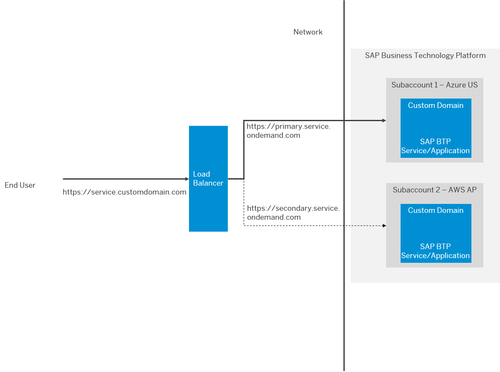

<!-- loio0ed62d9b911e48b88b88bb70cc55968b -->

# Reference Use Cases for Multi-Region Architectures

Implement multi-region architectures for applications deployed on SAP BTP, based on several reference use cases.

You can implement multi-region architectures for the applications that are deployed on SAP BTP, such as for SAP CAP applications or SAP SaaS applications such as SAP Launchpad service or SAP Cloud Integration, by introducing geographic redundancy, application health checks and the application synchorinzation between different regions. To monitor the health of the applications in two data centers, you can use any of the available hyperscaler solutions such as Azure Traffic Manger or Amazon Route 53.

<a name="loio0ed62d9b911e48b88b88bb70cc55968b__section_qcx_kjh_rvb"/>

## High-Level Architecture

In this setup, we create a common URL from a custom domain instead of the URL provided by the SAP BTP services or applications. We then deploy the application across multiple regions \(subaccounts\) and leverage load balancer configurations to route the requests intelligently from the custom domain URL to the healthy application based on the health checks. In case of a failover, the switch to the healthy application is seamless because the URL that the user accesses remains the same. In the background, the requests are routed to the healthy service based on the configuration that you've maintained.

  

Leveraging geographic redundancy, even if there is an outage across the whole region, the other region’s application are served to the users, eliminating the single point of failure. The same architecture can also address global users’ latency issues or divide the load on the services equally between different regions.

<a name="loio0ed62d9b911e48b88b88bb70cc55968b__section_fyd_ljh_rvb"/>

## Use Cases

Explore the following use cases to get to know the specific steps and technical details that you need to implement a multi-region architecture for your applications:

<table>
<tr>
<th valign="top">

Description

</th>
<th valign="top">

Blog Post

</th>
<th valign="top">

GitHub

</th>
<th valign="top">

Discovery Center Mission

</th>
</tr>
<tr>
<td valign="top">

Multi-region high availability architecture for SAP Launchpad service using Azure Traffic Manager

</td>
<td valign="top">

[Multi-region High Availability architecture for SAP BTP Launchpad Service using Azure Traffic Manager](https://blogs.sap.com/2022/08/02/multi-region-high-availability-architecture-for-sap-btp-launchpad-service-using-azure-traffic-manager)

</td>
<td valign="top">

[https://github.com/SAP-samples/btp-services-intelligent-routing/tree/launchpad\_azure](https://github.com/SAP-samples/btp-services-intelligent-routing/tree/launchpad_azure)

</td>
<td valign="top">

[Route Multi-Region Traffic to SAP BTP Services Intelligently](https://discovery-center.cloud.sap/missiondetail/3603/)

</td>
</tr>
<tr>
<td valign="top">

Multi-region high availability architecture for SAP Launchpad service using Amazon Route 53

</td>
<td valign="top">

[High Availability of SAP Launchpad Service with Amazon Route 53](https://blogs.sap.com/2022/11/04/high-availability-of-sap-launchpad-service-with-amazon-route-53/)

</td>
<td valign="top">

[https://github.com/SAP-samples/btp-services-intelligent-routing/tree/launchpad\_aws](https://github.com/SAP-samples/btp-services-intelligent-routing/tree/launchpad_aws)

</td>
<td valign="top">

 

</td>
</tr>
<tr>
<td valign="top">

Distributed Resiliency of CAP applications using SAP HANA Cloud \(Multi-Zone Replication\) with Azure Traffic Manager

</td>
<td valign="top">

 

</td>
<td valign="top">

[https://github.com/SAP-samples/cap-distributed-resiliency/tree/SAP-HANA-Cloud](https://github.com/SAP-samples/cap-distributed-resiliency/tree/SAP-HANA-Cloud)

</td>
<td valign="top">

 

</td>
</tr>
<tr>
<td valign="top">

Distributed Resiliency of SAP CAP applications using Amazon Aurora \(Read Replica\) with Amazon Route 53

</td>
<td valign="top">

 

</td>
<td valign="top">

[https://github.com/SAP-samples/cap-distributed-resiliency/tree/Amazon-Aurora](https://github.com/SAP-samples/cap-distributed-resiliency/tree/Amazon-Aurora)

</td>
<td valign="top">

 

</td>
</tr>
<tr>
<td valign="top">

Intelligent Routing for SAP Cloud Integration using Azure Traffic Manager

</td>
<td valign="top">

 

</td>
<td valign="top">

[https://github.com/SAP-samples/btp-services-intelligent-routing/tree/ci\_azure](https://github.com/SAP-samples/btp-services-intelligent-routing/tree/ci_azure)

</td>
<td valign="top">

[Route Multi-Region Traffic to SAP BTP Services Intelligently](https://discovery-center.cloud.sap/missiondetail/3603/)

</td>
</tr>
</table>

**Related Information**  

[SAP BTP Multi-Region reference architectures for High Availability and Resiliency](https://blogs.sap.com/2022/07/21/sap-btp-multi-region-reference-architectures-for-high-availability-and-resiliency/)

