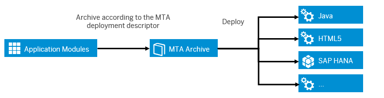

<!-- loio41184aabb5d04839b8bd29564aa850e5 -->

# Using Multitarget Applications to Manage Dependencies

One challenge of moving into the cloud is deploying applications that consist of multiple interconnected components. We recommend that you develop multitarget applications that let you package those components into one bundle, and deploy and manage them all at once.

Cloud applications often come with a lot of heterogeneity, which is one of the key strengths of cloud development, allowing for agility, resilience, and the rapid development of new features. However, it also increases the complexity of cloud applications, which:

-   Usually consist of multiple interdependent software modules
-   Are written in different programming languages using multiple development tools
-   Might involve different products
-   May be deployed to multiple target runtimes

A combined lifecycle lets you deploy all parts together, automatically, and in the right order, and manage the configuration of the complete solution. You can achieve such a combined lifecycle by developing multitarget applications. Each multitarget application has the following characteristics:

-   One archive file that includes all modules and a description of the dependencies
-   Can be delivered, transported, linked to SAP software components, and deployed
-   The process can be automated in a continuous integration pipeline

The multitarget application archive contains all required application types and configurations, as well as a deployment descriptor file. It is intended to be used as a generic artifact that can be deployed and managed on several SAP BTP subaccounts. For example, you can use one multitarget application archive in your development subaccount and reuse it in your production subaccounts.

As all interdependencies are part of the archive file, it's easy to pass multitarget applications from development to operations. All required information for deployment is provided during the development process. Due to the benefits provided by applying the multitarget application approach, it is also part of the SAP Cloud Application Programming Model.

> ### Recommendation:  
> The approach isn't mandatory for applications that are running on SAP BTP – you can also develop without applying it. Without the multitarget application approach, you'll need to manually deploy your application artifacts, for example by triggering the deployment from SAP Web IDE or manually uploading artifacts via SAP BTP cockpit.
> 
> We recommend that you use multitarget applications in the following cases:
> 
> -   You're developing a business application composed of several different parts – apps, services, content, and others – that you want to manage as a single unit.
> 
> -   Your business application has dependencies to external resources, such as backing services \(database, messaging, and so on\), APIs, and configurations from other applications.
> 
> -   Your business application has a certain default configuration, for example memory, disk, number of individual app instances, environment variables, service plans, and others.

For more conceptual information about multitarget applications and detailed step-by-step instructions, see [Multitarget Applications in the Cloud Foundry Environment](https://help.sap.com/viewer/50fd4b19521f4bec9ee9cc6c72a90872//en-US/d04fc0e2ad894545aebfd7126384307c.html "A Multitarget application (MTA) is logically a single application comprised of multiple parts created with different technologies, which share the same lifecycle.") :arrow_upper_right:.

There are several options to create multitarget application archives:

-   If you use SAP Web IDE Full-Stack, you can use multitarget application templates for Cloud Foundry applications, where the descriptor file is maintained automatically, for example, whenever you add a new module in the SAP Web IDE.

-   If you have development modules from other sources, you can use the multitarget application archive builder, a Java-based command-line tool that builds modules and packages them into a deployable multitarget application archive, together with a deployment descriptor. It is available for download from SAP Development Tools \(see [https://tools.hana.ondemand.com/\#cloud](https://tools.hana.ondemand.com/#cloud)\).

-   If you have solutions already deployed in the Neo environment, you can use the solution export wizard, as offered in the Solutions view of the SAP BTP cockpit. The wizard lets you select existing components \(considering interdependencies automatically\) and offers to download the multitarget application archive \(not supported for archives comprising Java modules\) or descriptor files, or to integrate the changes into transport management processes \(see [Deploy and Deliver](../deploy-and-deliver/Deploy_and_Deliver_5972cdb.md)\). Applications, configuration content, such as destinations, roles, and security groups are supported. For more information, see [Exporting Solutions](https://help.sap.com/viewer/663f91a6573b49ae9fa5f0007abb4d18/Internal/en-US/14a0ff1480494bcd993674061fb4f505.html "") :arrow_upper_right: on SAP Help Portal.

-   **[Establishing a Provider/Subscriber Scenario Using Multitenancy](Establishing_a_ProviderSubscriber_Scenario_Using_Multitenancy_617af9b.md "The provider/subscriber approach is one of the important scenarios that that are supported with multitarget application.")**  
The provider/subscriber approach is one of the important scenarios that that are supported with multitarget application.

