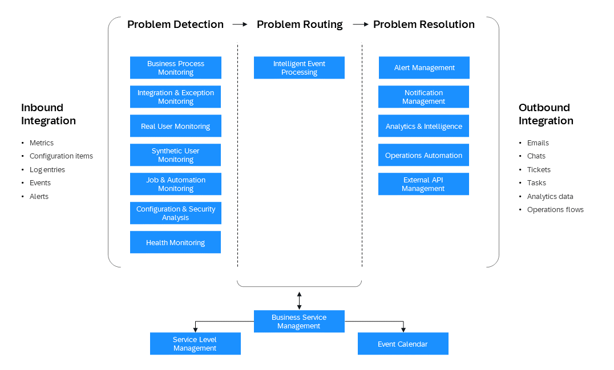

<!-- loiob0ab4fb5cb914ee19923e4a8f020e868 -->

# Go Live and Operate

Once you've deployed, transported, tested, and integrated your application, you can go live.

<a name="loiob21821e37ea14f69af731bf5811af338"/>

<!-- loiob21821e37ea14f69af731bf5811af338 -->

## Going Live

Once you've tested your application successfully and ensured that you are compliant with any applicable security guidelines and compliance regulations, you can go live with your application.

If you've set up a staged development environment, we recommend that your Cloud Administration Team defines specific timeframes during which the Cloud Development Team is allowed to go live with an application. You can forbid go-live activities during times that a stable landscape is particularly crucial \(for example, at the end of each quarter\), and allow deployments to your production subaccount only in case of emergencies.

Consider embedding applications with internal end users in the SAP Fiori launchpad using SAP BTP Portal before you go live. This enables your internal target audience to access all applications in one central place and thus improves the app's usability. For more information, see [SAP Cloud Portal Service](https://help.sap.com/viewer/ad4b9f0b14b0458cad9bd27bf435637d/Cloud/en-US/5798687972fd4c2bace31c65b47f5587.html).

<a name="loiob21821e37ea14f69af731bf5811af338__section_b2p_p5d_fpb"/>

## Manage Authentication and Authorization

Ensure that the business users of your application are being provided by using SAP ID service or configuring the trust relationship to an external identity provider. They should also get the right authorization by using application-based authorization artifacts provided by the developers. This allows the administrators to create roles, build role collections, and assign these collections to business users and user groups.

For more information, see [Security Administration: Managing Authentication and Authorization](https://help.sap.com/viewer/65de2977205c403bbc107264b8eccf4b/Cloud/en-US/1ff47b2d980e43a6b2ce294352333708.html "This section describes the tasks of administrators in the Cloud Foundry environment of SAP BTP. Administrators ensure user authentication and assign authorization information to users and user groups.") :arrow_upper_right: .

<a name="loiob21821e37ea14f69af731bf5811af338__section_lcm_pll_zgb"/>

## Web Acceleration

If your application's end users are widely spread across different countries or even continents, you can improve your application's load performance by using a Content Delivery Network \(CDN\). For example, you can use common CDN providers such as Akami or Cloudflare.

If you include SAP’s SAPUI5 library directly from *\*.hana.ondemand.com*, the SAPUI5 resources are automatically delivered via a CDN. See [Variant for Bootstrapping from Content Delivery Network](https://sapui5.hana.ondemand.com/#/topic/2d3eb2f322ea4a82983c1c62a33ec4ae).

Consider the following when using a CDN:

-   Secure transport: Make sure any access via HTTP will get redirected to a HTTPS connection before loading any content.

-   Block access based on location: If blocking access from a certain country is required, the client’s location data can be used. Keep in mind that this does not guarantee a full blocking, since the client’s location data can be changed, or the client could access from another country via a virtual private network \(VPN\).

-   Content compression: You can compress your content with gzip before it gets delivered to the client. This improves the performance, especially for clients with a slow connection.

-   Content caching: In addition to client caching, you can make the CDN provider cache your server’s content, so that following requests of the same resources by other clients will be delivered faster. While this can additionally improve the performance, you need to keep in mind the following:

    -   Make sure that you only cache static content. We recommend that you exclude certain files \(for example, for UI5 apps, exclude the neo-app.json file\) or paths \(for example, a route to OData services\), to make sure dynamic content is never cached.

    -   You should configure your CDN provider so that it respects the `Cache-Control` and `Expires` header of your server.

    -   You should not cache any dynamic header, such as the `X-CSRF-Token` header, that is used against cross-site request forgery \(CSRF\).

-   See [SAP Note 2943781](https://me.sap.com/notes/SAP Note 2943781) for information about using CDN for on-premise systems.

<a name="loio4fe96303d2064dc7a3d6a8d1dc873cfd"/>

<!-- loio4fe96303d2064dc7a3d6a8d1dc873cfd -->

## Operate Centrally with SAP Cloud ALM

Use SAP Cloud ALM to monitor and operate your landscape.

SAP Cloud ALM is included in your SAP Cloud Service subscription containing Enterprise Support, cloud editions, in SAP Enterprise Support and in Product Support for Large Enterprises.

SAP Cloud ALM helps you to implement and operate intelligent cloud and hybrid business solutions. You benefit from an out-of-the-box, native cloud solution running on SAP BTP, designed as the central entry point to manage your complete SAP landscape with content-driven guided implementation and highly automated operations.

With with the operations solutions in SAP Cloud ALM, you can handle both SAP BTP-based SaaS applications and your own applications.

SAP Cloud ALM for operations provides a personalized and unified operations user experience. You can use purpose-driven different monitoring, analysis, and management use cases optimized for certain operations aspects. SAP Cloud ALM for operations empowers you to understand the health of your SAP business solutions and acts as collaboration platform between lines of business and IT.

Under [Supported Solutions](https://help.sap.com/docs/cloud-alm/setup-administration/supported-solutions), you see which monitoring capabilities are available with SAP Cloud ALM. Under *SAP Solution*, filter for BTP and check the supported services from the operations area.

Benefit from the powerful *Intelligent Event Processing*, embedded analytics, and intelligence functionality with a large variety of inbound and outbound integration. *Synthetic User Monitoring* monitors the performance and availability of web applications from a client-side perspective based on Selenium-based scripts. *Business Service Management* consolidates all operational events at business service level and shows them in a well-arranged event calendar.

Specifically for Java and Node.js custom-built applications in SAP BTP, Cloud Foundry runtime, there are the Data Collection Instrumentation Libraries based on Open Telemetry designed to enable the data collection infrastructure in SAP Cloud ALM. With these libraries, you can collect data for the following use cases:

-   *Real User Monitoring*: Leverage both front-end and back-end measurements on single request level.

-   *Health Monitoring*: Gain insights on application health based on technical metrics.

-   *Integration and Exception Monitoring*: Collect and react on exceptions raised by the application.

-   *Job and Automation Monitoring*: Monitor SAP Job Scheduling Service jobs.

SAP Cloud ALM is the central place to integrate and access the monitoring of your existing IT service management processes, such as ticketing systems.

Inbound and outbound APIs enable you to integrate data from your own applications. For more information, see the [API Guide for SAP Cloud ALM](https://help.sap.com/docs/cloud-alm/apis/api-reference).

<a name="loio4fe96303d2064dc7a3d6a8d1dc873cfd__section_lpw_vtc_pzb"/>

## More

-   [Implement SAP Cloud ALM](https://help.sap.com/docs/cloud-alm/setup-administration/provisioning) via SAP for Me

-   Application help for [SAP Cloud ALM for Operations](https://help.sap.com/docs/cloud-alm/applicationhelp/operations)

-   [SAP Cloud ALM for operations](https://support.sap.com/en/alm/sap-cloud-alm/operations.html) \(SAP Support Portal\)
-   [Expert Portal for SAP Cloud ALM Operations](https://support.sap.com/en/alm/sap-cloud-alm/operations/expert-portal.html) \(SAP Support Portal\), with detailed configuration instructions

<a name="loio318c3653da0f42c88bd7a1c38273f79e"/>

<!-- loio318c3653da0f42c88bd7a1c38273f79e -->

## Involve Local SAP BTP Tools for Operations

Navigate from central observability capabilities of SAP Cloud ALM to local SAP BTP expert tools or trigger them from SAP Cloud ALM, such as for a use-case specific root cause analysis or for an automated alert remediation.

There are various options you can use to monitor applications and services on SAP BTP, provided natively by the platform itself. Your choice may depend on the SAP BTP runtime you work in. But let's first look at the runtime-agnostic SAP Job Scheduling service.

<a name="loio318c3653da0f42c88bd7a1c38273f79e__section_tnw_5qn_11c"/>

## SAP Job Scheduling service

SAP Job Scheduling service allows you to define and manage jobs that run once or on a recurring schedule. Use this runtime-agnostic service to schedule action endpoints in your application or long-running processes using Cloud Foundry tasks. Use REST APIs to schedule jobs, including long-running jobs asynchronously, and create multiple schedule formats for simple and complex recurring schedules. Manage jobs and tasks and manage schedules with a web-based user interface.

For more information, see [SAP Job Scheduling Service](https://help.sap.com/docs/job-scheduling?version=Cloud).

<a name="loio318c3653da0f42c88bd7a1c38273f79e__section_jsb_jz3_p2b"/>

## Monitoring Applications in the Cloud Foundry and Kyma Runtimes

SAP Cloud Logging is an observability service to store, visualize, and analyze application logs, metrics, and traces from SAP BTP Cloud Foundry, Kyma, Kubernetes and other runtime environments. It enables application developers and operators to analyze their SAP BTP workloads regarding performance, errors, usage, and other characteristics. For Cloud Foundry and Kyma, it offers an easy integration by providing predefined contents to investigate load, latency, and error rates of the observed applications based on their requests and correlate them with additional data.

In Cloud Foundry, SAP Cloud Logging is the successor of the SAP Application Logging service. In the Cloud Foundry runtime, you can still use the [SAP Application Logging service for SAP BTP](https://help.sap.com/viewer/ee8e8a203e024bbb8c8c2d03fce527dc/Cloud/en-US/68454d44ad41458788959485a24305e2.html) to access logs from your applications.

<a name="loio318c3653da0f42c88bd7a1c38273f79e__section_cld_pdx_42b"/>

## Monitoring Applications in the Neo Environment

In the Neo environment, you can use the cockpit to monitor applications:

**Monitoring Applications Using the Cockpit in the Neo Environment**

<table>
<tr>
<th valign="top">

Application Type

</th>
<th valign="top">

Monitoring Options

</th>
<th valign="top">

More Information

</th>
</tr>
<tr>
<td valign="top">

Java applications

</td>
<td valign="top">

-   Application monitoring

-   Custom thresholds

-   Availability checks

-   Custom JMX checks

-   Heap and thread dumps

-   Email alert notifications

-   Monitoring APIs

-   Application logging

-   Logs API

</td>
<td valign="top">

[Monitoring Java Applications](https://help.sap.com/docs/monitoring-service/sap-monitoring-service-for-sap-btp/monitoring-java-applications?version=Cloud)

[Using Logs in the Cockpit for Java Applications](https://help.sap.com/docs/application-logging-service/sap-application-logging-service-for-neo-environment/using-logs-in-cockpit-for-java-applications?version=Cloud)

</td>
</tr>
<tr>
<td valign="top">

SAP HANA XS applications

</td>
<td valign="top">

-   Application monitoirng

-   Availability checks

-   Custom HTTP checks

-   Email alert notifications

-   Monitoring APIs

-   Health statistics for SAP HANA database instances

</td>
<td valign="top">

[Monitoring Database Systems](https://help.sap.com/docs/monitoring-service/sap-monitoring-service-for-sap-btp/monitoring-database-systems?version=Cloud) 

</td>
</tr>
<tr>
<td valign="top">

HTML5 applications

</td>
<td valign="top">

-   Application monitoirng

-   Custom checks

-   Email alert notifications

-   Monitoring APIs

-   Application logging

-   Logs API

</td>
<td valign="top">

[Monitoring HTML5 Applications](https://help.sap.com/docs/monitoring-service/sap-monitoring-service-for-sap-btp/monitoring-html5-applications?version=Cloud)

[Using Logs in the Cockpit for HTML5 Applications](https://help.sap.com/docs/application-logging-service/sap-application-logging-service-for-neo-environment/using-logs-in-cockpit-for-html5-applications?version=Cloud)

</td>
</tr>
</table>

You can also connect your Java applications to a **Dynatrace SaaS monitoring environment**. For more information, see [Agent Activation for Dynatrace](https://help.sap.com/viewer/p/DYNATRACE_AGENT_ACTIVATION).

<a name="loio318c3653da0f42c88bd7a1c38273f79e__section_dyj_n1j_p2b"/>

## Monitoring Platform and Service Availability

You can follow the availability of the platform at [SAP Trust Center](https://www.sap.com/about/trust-center/cloud-service-status.html). You can check:

-   the availability by service on the *SAP BTP* tile of the *Cloud Status* tab page;

-   the availability by region on the *Data Center* tab page.

To get notifications for updates and downtimes, subscribe at the [Cloud System Notification Subscriptions](https://support.sap.com/en/my-support/systems-installations/cac.html) application. Create a subscription by specifying Cloud Product, Cloud Service, and Notification Type. For more information, see [Cloud System Notification Subscriptions User Guide](https://support.sap.com/content/dam/support/en_us/library/ssp/my-support/systems-installations/cac/csns_user_guide.pdf).

In addition, you can get a personalized, at-a-glance view of additional SAP BTP offerings in the [Cloud Availability section of SAP for Me](https://support.sap.com/en/my-support/systems-installations/cac.html), such as SAP BTP Integration.

There are additional monitoring tools and options available for certain SAP BTP services, such as the SAP BTP Identity Authentication service. Please refer to the respective service documentation for more details: [Solutions and Services](https://help.sap.com/viewer/65de2977205c403bbc107264b8eccf4b/Cloud/en-US/7613d9ce711e1014839a8273b0e91070.html#loio7613d9ce711e1014839a8273b0e91070 "Consume the solutions and services by SAP BTP according to your preferred development environment and use cases.") :arrow_upper_right:.

<a name="loio318c3653da0f42c88bd7a1c38273f79e__section_kpd_cnj_wfb"/>

## Alerting

In addition to the general notifications mentioned above, SAP Alert Notification service for SAP BTP lets you know instantly whenever there's an issue with your specific cloud application or its dependencies, independent of the runtime your apps are running in. You can subscribe to events coming from SAP BTP services, hyperscalers, third-party tools such as Dynatrace, or you can create custom alerts for your apps that can be pushed directly into the public APIs of SAP Alert Notification service for SAP BTP.

Furthermore, you can subscribe to notifications of your interest and choose the most appropriate channel for delivery, such as email, instant messages to your corporate chat, a ticketing system \(e.g. Jira, ServiceNow, etc.\), or SAP Cloud ALM. .

For more information, see [SAP Cloud ALM](https://support.sap.com/en/alm/sap-cloud-alm.html) and [SAP Alert Notification Service](https://help.sap.com/viewer/p/ALERT_NOTIFICATION).

<a name="loio70c5c1cc739041088b16bd32703a429a"/>

<!-- loio70c5c1cc739041088b16bd32703a429a -->

## Ops Automation

To simplify and automate complex manual technical processes that are required to run your applications on SAP BTP, consider to use using SAP Automation Pilot service.

SAP Automation Pilot service provides catalogs of commands for application lifecycle management, database management, SAP BTP resource and runtime handling, and many more. These provided out-of-the-box automation commands can be complemented by your own content, such your own scripts, HTTP requests, btp CLI tasks, etc. They can then be used in a low-code/no-code approach to compile recommended actions or complex processes to be executed ad hoc or automatically triggered by SAP Cloud ALM and SAP Alert Notification services for SAP BTP upon a specific event. This helps you reduce your technical operations efforts and make your scenarios more reliable.

For more information, see [SAP Automation Pilot](https://help.sap.com/docs/automation-pilot).

