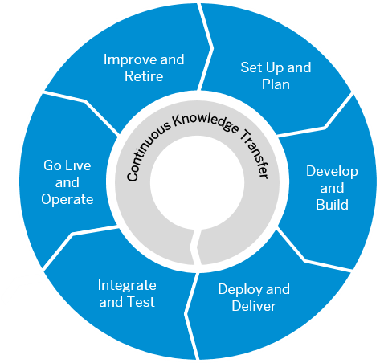

<!-- loio9f2bb927464e4d1ba3d13b2d79ca9bd1 -->

# Best Practices for SAP BTP

This document helps you plan and set up your landscape and your lifecycle management for running applications on SAP Business Technology Platform \(SAP BTP\). It contains best practices and recommendations for planning development projects – from setting up the correct organizational structure to creating an account and security model, to developing and operating applications.

<a name="loio9f2bb927464e4d1ba3d13b2d79ca9bd1__section_fj5_bqh_vdb"/>

## Is This Guide for You?

This guide is the starting point for setting up application lifecycle management for your specific use case, business, and IT landscape. It contains recommendations and best practices that give you an overview of what you should consider when planning development projects on SAP BTP. It does not contain specific task descriptions, but does include links to step-by-step instructions when required.

If you're an **architect or a development project lead**, this guide helps you plan your organizational setup and your account and security model. It has an overview of processes, tools, and services that are available for developing and operating applications. Please note that SAP is currently renovating and adding core functionalities to SAP BTP and as part of this process, global accounts are migrated from the existing cloud management tools feature set A to the renovated cloud management tools feature set B. New global accounts will be on feature set B which brings a more flexible account model with so-called **directories** to group and manage subaccounts inside your global account. For more information, see [Cloud Management Tools - Feature Set Overview](https://help.sap.com/viewer/65de2977205c403bbc107264b8eccf4b/Cloud/en-US/caf4e4e23aef4666ad8f125af393dfb2.html). In this Best Practices guide, you will get recommendations for feature set A and B. They are marked as such, but please ensure that you know if you are on feature set B already.

If you're an **administrator or developer**, this guide helps you define the correct methodologies and tools for your development project.

If you're an **SAP partner**, this guide helps you to set up SAP BTP for developing and running production services for your customers.

> ### Note:  
> This guide is targeted at customers who want to run and use applications in a production environment. If you're an SAP BTP trial user, you might still find that some information in this guide is useful. Check out the following page for more details about trial accounts: [Trial Accounts and Free Tier](https://help.sap.com/viewer/65de2977205c403bbc107264b8eccf4b/Cloud/en-US/046f127f2a614438b616ccfc575fdb16.html "Explore the different options for trying out SAP BTP.") :arrow_upper_right:. Please note that the services available in the trial version differ from the ones in the enterprise version.

<a name="loio9f2bb927464e4d1ba3d13b2d79ca9bd1__section_tf1_xml_s2b"/>

## How to Use This Guide

If you're **new to SAP BTP**:

-   SAP BTP is an integrated offering comprised of four technology portfolios: database and data management, application development and integration, analytics, and intelligent technologies. The platform offers users the ability to turn data into business value, compose end-to-end business processes, and build and extend SAP applications quickly. It is a vital part of the transition to the Intelligent Enterprise. The application development and integration capabilities of SAP BTP enable you to develop new applications, extend existing ones, and are at the center of integration scenarios. For more information about the Intelligent Enterprise, see [https://www.sap.com/products/intelligent-enterprise.html](https://www.sap.com/products/intelligent-enterprise.html)

-   [Basic Platform Concepts](../basic-platform-concepts/Basic_Platform_Concepts_38ecf59.md#loio38ecf59cdda64150a102cfaa62d5faab) – regions, environments, accounts, members, quotas, capabilities and links to in-depth explanations.

-   [Shared Responsibility Model Between You and SAP](../shared-responsibility/Shared_Responsibility_Model_Between_You_and_SAP_898509d.md) – your responsibilities and SAP's responsibilities when it comes to application lifecycle management.

-   [Getting Started Checklist](../getting-started-checklist/Getting_Started_Checklist_cbd7663.md) – prerequisites and steps to help you get started with your development project.

If you're **familiar with SAP BTP**:

Plan and set up your landscape to manage the lifecycle of your cloud applications.

-   [Improve and Retire](../improve-and-retire/Improve_and_Retire_89ffeab.md#loio89ffeab7ea7742fd9a1ad2de4970b077)
-   [Set Up and Plan](../set-up-and-plan/Set_Up_and_Plan_75e5031.md)
-   [Develop and Build](../develop-and-build/Develop_and_Build_7e30686.md)
-   [Deploy and Deliver](../deploy-and-deliver/Deploy_and_Deliver_5972cdb.md)
-   [Integrate and Test](../integrate-and-test/Integrate_and_Test_84ddc25.md#loio84ddc25bf6024506b9c56fbbe4438169)
-   [Go Live and Monitor](../go-live-and-monitor/Go_Live_and_Monitor_b0ab4fb.md#loiob0ab4fb5cb914ee19923e4a8f020e868)

1.  **[Set Up and Plan](../set-up-and-plan/Set_Up_and_Plan_75e5031.md)** – build teams, set up your account and security model, and create an enrollment process for your development projects.
2.  **[Develop and Build](../develop-and-build/Develop_and_Build_7e30686.md)** – find out about the tools and programming languages that are available on SAP BTP, and how to use multitarget applications to efficiently manage dependencies.
3.  **[Deploy and Deliver](../deploy-and-deliver/Deploy_and_Deliver_5972cdb.md)** – deploy and deliver simple and multitarget applications.
4.  **[Integrate and Test](../integrate-and-test/Integrate_and_Test_84ddc25.md#loio84ddc25bf6024506b9c56fbbe4438169)** – test and integrate your application with other solutions.
5.  **[Go Live and Monitor](../go-live-and-monitor/Go_Live_and_Monitor_b0ab4fb.md#loiob0ab4fb5cb914ee19923e4a8f020e868)** – learn what's important for going live and monitoring applications, services, and hybrid landscapes.
6.  **[Improve and Retire](../improve-and-retire/Improve_and_Retire_89ffeab.md#loio89ffeab7ea7742fd9a1ad2de4970b077)** – make improvements to your application, perform housekeeping, and learn about what's important to consider when you want to retire it.

<a name="loio9f2bb927464e4d1ba3d13b2d79ca9bd1__section_ct1_ndt_lgb"/>

## Related Resources

The learning jouneys [Lifecycle-Management of Applications on SAP BTP](https://help.sap.com/doc/0c3db190da2c4866a1f2906763d4f59a/Cloud/en-US/358ae3bc28d14c6ea9e46c37a2455a53.html) and [DevOps for Application Development on SAP BTP](https://help.sap.com/doc/221f8f84afef43d29ad37ef2af0c4adf/HP_2.0/en-US/2297e49af15c4ebba9246efb18fc5d96.html) are extensive, well-structured collections of links to resources such as videos, blog posts, openSAP courses, and additional documentation.

