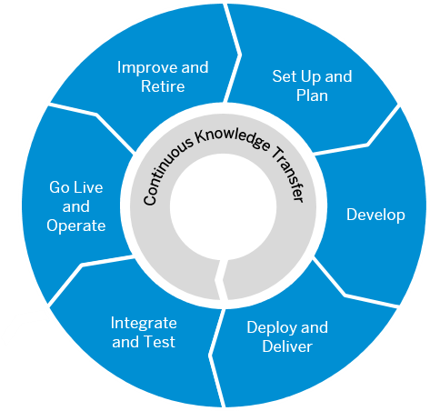

<!-- loio9f2bb927464e4d1ba3d13b2d79ca9bd1 -->

# SAP BTP Administrator's Guide

This guide is the starting point for setting up application lifecycle management for your specific use case, business, and IT landscape. It contains recommendations and best practices that give you an overview of what you should consider when planning development projects on SAP BTP – from setting up the correct organizational structure to creating an account and security model, to developing and operating applications. It also includes links to step-by-step instructions when required.

<a name="loio9f2bb927464e4d1ba3d13b2d79ca9bd1__section_fj5_bqh_vdb"/>

## Is This Guide for You?

If you're an **architect or a development project lead**, this guide helps you plan the architecture of your application and establish boundary conditions to foster the required level of governance and compliance for your development teams \(such as by defining the best-fitting delivery and observability concepts\).

If you're an **administrator**, this guide helps you define the correct organizational structure and create an account and security model. Also, it enables you to understand and plan the tasks required to run your organization's applications on SAP BTP reliably - and which SAP BTP services to consider for doing so.

If you're an **SAP partner**, this guide helps you to set up SAP BTP for running production services for your customers.

> ### Tip:  
> If you're a **developer**, you have to define the correct methodologies and tools for your development project. In this case, use the [SAP BTP Developer’s Guide](https://help.sap.com/docs/btp/btp-developers-guide/what-is-btp-developers-guide?locale=en-US&version=Cloud).

> ### Note:  
> This guide is targeted at customers who want to run and use applications in a production environment. If you're an SAP BTP trial user, you might still find that some information in this guide is useful. Check out the following page for more details about trial accounts: [Trial Accounts and Free Tier](https://help.sap.com/viewer/65de2977205c403bbc107264b8eccf4b/Cloud/en-US/046f127f2a614438b616ccfc575fdb16.html "Explore the different options for trying out SAP BTP.") :arrow_upper_right:. Please note that the services available in the trial version differ from the ones in the enterprise version.

<a name="loio9f2bb927464e4d1ba3d13b2d79ca9bd1__section_tf1_xml_s2b"/>

## Prerequisites

If you're new to SAP BTP, read:

-   [SAP Business Technology Platform](https://www.sap.com/products/technology-platform/what-is-sap-business-technology-platform.html)

    SAP BTP is a cloud platform that brings together application development, automation, data management, analytics and planning, integration, and AI capabilities into one unified environment optimized for SAP applications. It offers:

    -   An intuitive, modern development environment for both, professional IT as well as citizen and business developers

    -   Built-in data models, integrations, workflows, app templates, and AI business services

    -   Self-service data discovery, modeling, planning, and analytics for business users in a governed environment

-   [SAP BTP Guidance Framework](https://help.sap.com/docs/sap-btp-guidance-framework/guidance-framework/what-is-sap-btp-guidance-framework)

    This is the central access point for architects, developers, and administrators to build and run enterprise-grade solutions on SAP BTP. It comprises decision guides, reference architectures, methodologies, recommendations, and DevOps principles.

-   [Basic Platform Concepts](https://help.sap.com/docs/btp/sap-business-technology-platform/btp-basic-platform-concepts?version=Cloud)

    Contains regions, runtimes, accounts, members, quotas, capabilities and links to in-depth explanations.

-   [Getting Started Checklist](https://help.sap.com/docs/BTP/df50977d8bfa4c9a8a063ddb37113c43/cbd76632d8aa4cb7bbf175d7607db463.html?locale=en-US&state=PRODUCTION&version=Cloud)

    Explains your responsibilities and SAP's responsibilities when it comes to application lifecycle management.

-   [SAP BTP Developer’s Guide](https://help.sap.com/docs/btp/btp-developers-guide/what-is-btp-developers-guide?locale=en-US&version=Cloud)

    This guide helps you improve the process of implementing a business application on SAP BTP. It's part of the SAP BTP Guidance Framework and contains recommendations and best practices that give you an overview of what you should consider when working on development projects on SAP BTP.

-   [**Administrating SAP Business Technology Platform**](https://learning.sap.com/learning-journeys/administrating-sap-business-technology-platform-1)

    This learning journey provides an extensive, well-structured collection of links to resources such as videos, blog posts, openSAP courses, and additional documentation.

-   Check out the [SAP Discovery Center](https://discovery-center.cloud.sap/) to get an overview on the available SAP BTP **services**, discover **missions** that guide you step-by-step, and explore **reference architectures**.

<a name="loio9f2bb927464e4d1ba3d13b2d79ca9bd1__section_bt3_2rf_zcc"/>

## How to Use This Guide

Plan and set up your landscape to manage the lifecycle of your cloud applications.

1.  **[Set Up and Plan](../set-up-and-plan/set-up-and-plan-75e5031.md)** – build teams, set up your account and security model, and create an enrollment process for your development projects.
2.  **[Develop and Build](../develop-and-build-8a44d9c.md)** – find out about the tools and programming languages that are available on SAP BTP, and how to use multitarget applications to efficiently manage dependencies.
3.  **[Deploy and Deliver](../deploy-and-deliver/deploy-and-deliver-5972cdb.md)** – deploy and deliver simple and multitarget applications.
4.  **[Integrate and Test](../integrate-and-test/integrate-and-test-84ddc25.md#loio84ddc25bf6024506b9c56fbbe4438169)** – test and integrate your application with other solutions.
5.  **[Go Live and Operate](../go-live-and-monitor/go-live-and-operate-b0ab4fb.md#loiob0ab4fb5cb914ee19923e4a8f020e868)** – learn what's important for going live and operating applications, services, and hybrid landscapes.
6.  **[Improve and Retire](../improve-and-retire/improve-and-retire-89ffeab.md#loio89ffeab7ea7742fd9a1ad2de4970b077)** – make improvements to your application, perform housekeeping, and learn about what's important to consider when you want to retire it.

<a name="loio9f2bb927464e4d1ba3d13b2d79ca9bd1__section_qrh_kyc_r1c"/>

## Contribute to This Guide

> ### Tip:  
> The English version of this guide is open for contributions and feedback using GitHub. This allows you to get in contact with responsible authors of SAP Help Portal pages and the development team to discuss documentation-related issues. To contribute to this guide, or to provide feedback, choose the corresponding option on SAP Help Portal:
> 
> -   *Feedback* \> *Create issue*: Provide feedback about a documentation page. This option opens an issue on GitHub.
> 
> -   *Feedback* \> *Edit page*: Contribute to a documentation page. This option opens a pull request on GitHub.
> 
> 
> You need a GitHub account to use these options.
> 
> More information:
> 
> -   [Contribution Guidelines](https://help.sap.com/docs/open-documentation-initiative/contribution-guidelines/readme.html)
> 
> -   [Introduction Video](https://www.youtube.com/watch?v=WJ0oarMlVW4)
> 
> -   [Introduction Blog Post](https://blogs.sap.com/2021/11/29/sap-btp-documentation-goes-github-new-collaboration-process/)

