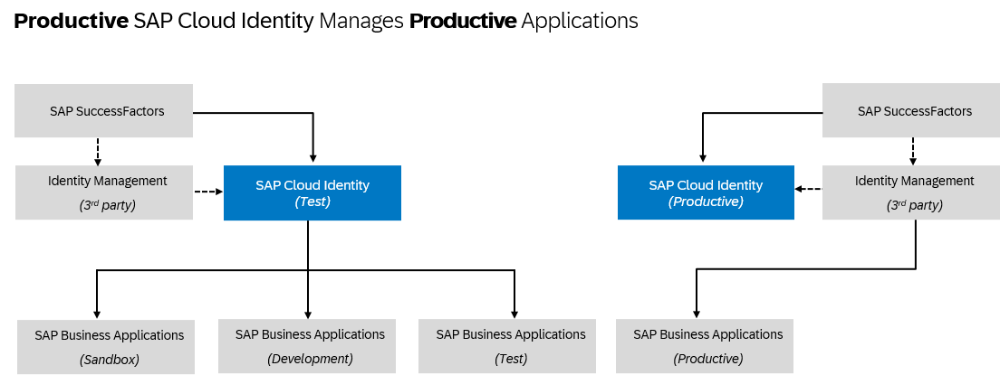
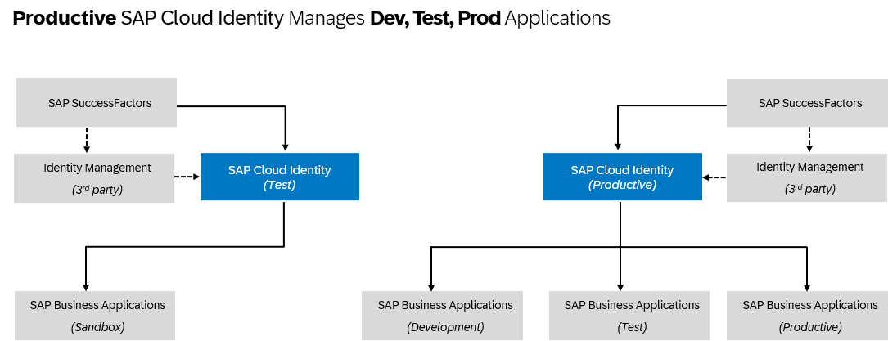
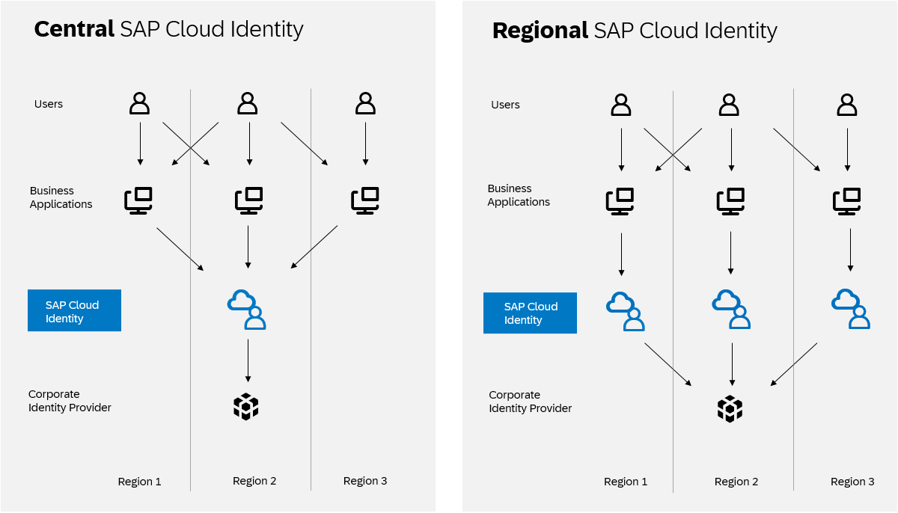

<!-- loio9c897ee8df014b3b8d7c67bab16f385c -->

# Onboard to SAP Cloud Identity Services

When setting up accounts, you need to assign users. While we provide you with your first users to get you started, your organization has identity providers that you want to integrate.

<a name="loio9c897ee8df014b3b8d7c67bab16f385c__context_md2_51s_gyb"/>

## Context

With your global account, you were provided a user to access to manage the platform. SAP BTP is preconfigured to use a default identity provider. As you begin to set up your account model, **don't** be tempted to add everyone in your organization who has a user in this identity provider.

You most likely already have your own identity and access management solution. Most importantly, in this solution you've defined your own security policies, such as password policies. The default identity provider doesn't support custom security policies. Nor does it support multifactor authentication, SCIM APIs, branding, or numerous other features.

SAP Cloud Identity Services is our solution for integrating identity and access not just with your own solution, but also across the solutions across SAP. If you didn't already have a tenant of SAP Cloud Identity Services, there's an option in the SAP BTP cockpit to request one.

**Tenant and Landscape Planning**

The standard offering for SAP Cloud Identity Services includes a productive tenant and a test tenant. Additional tenants can be requested in the SAP BTP Cockpit through the CPEA and Pay-As-You-Go consumption-based commercial models, or through the SAP SuccessFactors Upgrade Center. The lifetime of the additional tenants is tied to SAP BTP or SAP SuccessFactors.

For more information, see [Tenant Lifecycle](https://help.sap.com/docs/cloud-identity-services/cloud-identity-services/tenant-lifecycle?version=Cloud) and [Tenant Model and Licensing](https://help.sap.com/docs/IDENTITY_AUTHENTICATION/6d6d63354d1242d185ab4830fc04feb1/93160ebd2dcb40e98aadcbb9a970f2b9.html).

In the following figure, the landscape shows the integration of the SAP Cloud Identity Services productive tenant with your productive business applications. Additionally, the test tenant is used to manage your development, test, and sandbox environments. This setup allows you to separate users in the same way you separate business applications.

In the following figure, the landscape shows the SAP Cloud Identity Services productive tenant integrated with your development, test, and productive environments. The test tenant is used for testing your identity and access management processes in the sandbox environment. Choose this option if your business application layers require the security rules of the productive identity access management. This option reduces the effort of user management.

If neither of these options meet your needs, you have the freedom to define your landscape architecture yourself.

For more information, see [SAP Identity Access Management integration with SAP Cloud Identity Services](https://architecture.learning.sap.com/docs/ref-arch/20c6b29b1e) on the SAP Architecture Center.

> ### Recommendation:  
> Avoid setups where a test tenant of SAP Cloud Identity Services is used for a productive business solution.

> ### Recommendation:  
> We strongly recommend that you always use SAP Cloud Identity Services - Identity Authentication as a single identity provider for SAP BTP. If you use corporate identity providers, connect them to your Identity Authentication tenant, which then acts as a proxy. We especially recommend this configuration if you're using multiple corporate identity providers. For platform users, we require the use of SAP Cloud Identity Services - Identity Authentication as the custom identity provider. This configuration ensures the best integration with our services and solutions. You can use this service as a proxy for your corporate identity provider for platform users, too.
> 
>   
>   
> **Identity Providers and Federation**
> 
> 

**Multi-Region Landscape**

If your business operates in multiple regions and your applications are deployed across these areas, consider the following setup options for a central or multi-regional landscape. When using a corporate identity provider, you can connect it to either a single \(central\) SAP Cloud Identity Services tenant or multiple \(regional\) tenants, each acting as a proxy identity provider.

Consider the following pros and cons before making a decision:

<table>
<tr>
<th valign="top">

Identity Provider

</th>
<th valign="top">

Advantages

</th>
<th valign="top">

Disadvantages

</th>
</tr>
<tr>
<td valign="top">

Central identity provider

</td>
<td valign="top">

-   Users benefit from a consistent SSO experience across regions. All authentication requests are passed to the corporate identity provider through a central identity provider proxy.

-   Users benefit from a consistent Global User ID. Once they are created in the user store of SAP Cloud Identity Services – the Identity Directory, the attribute is generated and distributed across the business applications.

</td>
<td valign="top">

Users in remote regions might experience log-in latency.

For example, users in regions 1 and 3 always log in remotely and therefore always experience higher latency during authentication.

</td>
</tr>
<tr>
<td valign="top">

Regional identity providers

</td>
<td valign="top">

Users in remote regions experience log-in latency only during the initial log-in with the corporate identity provider.

Once the session is established and the regional SAP Cloud Identity Services tenants have the necessary information, there is no longer a need to forward requests to the corporate identity provider.

</td>
<td valign="top">

Users have the unique Global User ID per SAP Cloud Identity Services tenant, meaning users have different values in each proxy identity provider.

To maintain a single, consistent attribute value, configuration changes would be required.

</td>
</tr>
</table>

**Tenant Domains**

SAP Cloud Identity Services tenants can be hosted on a standard domain \(`ondemand.com`\), a common super domain \(`cloud.sap`\), or a custom domain tailored to your organization's needs. If you are using SAP Cloud Identity Services with a custom domain, ensure that you review the provided solutions for handling third-party cookies, as these are being phased out.

For more information, see [Handling Third Party Cookies Deprecation in Identity Authentication](https://community.sap.com/t5/technology-blog-posts-by-sap/handling-third-party-cookies-deprecation-in-identity-authentication/ba-p/13659277).

**Tenant Migration**

Migration of SAP Cloud Identity Services tenants between regions is possible by opening a support case. It may be necessary due to restrictions or legal requirements, such as data residency regulations. Migration ensures that user data remains within the specified region or country.

For more information, see [Get Your Tenant](https://help.sap.com/docs/IDENTITY_AUTHENTICATION/6d6d63354d1242d185ab4830fc04feb1/get-your-tenant?locale=en-US&state=PRODUCTION&version=Cloud).

**Tenant Reuse**

For organizations with multiple subsidiaries, SAP Cloud Identity Services tenants can be reused. This allows subsidiary companies to use the tenant associated with the global ultimate parent, which is the highest entity in the corporate structure.

For more information, see [Reuse SAP Cloud Identity Services Tenants for Different Customer IDs](https://help.sap.com/docs/cloud-identity-services/cloud-identity-services/reuse-sap-cloud-identity-services-tenants-for-different-customer-ids?version=Cloud).

Onboard to SAP Cloud Identity Services now.

<a name="loio9c897ee8df014b3b8d7c67bab16f385c__steps_t3d_y1s_gyb"/>

## Procedure

1.  Add a few more administrators to your SAP Cloud Identity Services tenant.

    These administrators can support the service in different time zones or if other administrators are sick or on vacation.

    For more information, see [Add Administrators](https://help.sap.com/docs/IDENTITY_AUTHENTICATION/6d6d63354d1242d185ab4830fc04feb1/bbbdbdd3899942ce874f3aae9ba9e21d.html) in the documentation of SAP Cloud Identity Services - Identity Authentication.

    > ### Tip:  
    > Unsure about which tenants you have and which administrators are assigned? Use the *SAP Cloud Identity Services - Tenants* application from the following link: [https://iamtenants.accounts.cloud.sap/](https://help.sap.com/docs/link-disclaimer?site=https%3A%2F%2Fiamtenants.accounts.cloud.sap%2F)

2.  Protect your tenant administrators with multifactor authentication.

    Administrators have critical access to the system. Set a higher security standard for authentication.

    For more information, see [Allow Users to Protect Accounts with Second Factor for Authentication](https://help.sap.com/docs/IDENTITY_AUTHENTICATION/6d6d63354d1242d185ab4830fc04feb1/d9cbb6d2fdf44819bc57e16f337b501b.html) in the documentation of SAP Cloud Identity Services - Identity Authentication.

3.  Configure system notifications and alerts for SAP Cloud Identity Services.

    For more information, see the following in the documentation of SAP Cloud Identity Services - Identity Authentication:

    -   [Send Security Alert Emails](https://help.sap.com/docs/IDENTITY_AUTHENTICATION/6d6d63354d1242d185ab4830fc04feb1/c97746478abe4a96b7a294ccc4633daa.html)

    -   [Send System Notifications via Emails](https://help.sap.com/docs/IDENTITY_AUTHENTICATION/6d6d63354d1242d185ab4830fc04feb1/aa04a8b6c60a440f866bfe30000e1e89.html)

4.  Configure SAP Cloud Identity Services - Identity Authentication as a proxy for your corporate identity provider.

    For more information, see [Corporate Identity Providers](https://help.sap.com/docs/IDENTITY_AUTHENTICATION/6d6d63354d1242d185ab4830fc04feb1/19f3eca47db643b6aad448b5dc1075ad.html).

<a name="loio9c897ee8df014b3b8d7c67bab16f385c__postreq_gvf_tgs_gyb"/>

## Next Steps

Now, you're ready to integrate SAP Cloud Identity Services with SAP BTP.

For more information, see [SAP BTP Integration Scenario](https://help.sap.com/docs/cloud-identity/system-integration-guide/sap-btp-integration-scenario) in the *System Integration Guide for SAP Cloud Identity Services*.

**Related Information**  

[What Are SAP Cloud Identity Services](https://help.sap.com/docs/cloud-identity/what-are-sap-cloud-identity-services/what-are-sap-cloud-identity-services)

