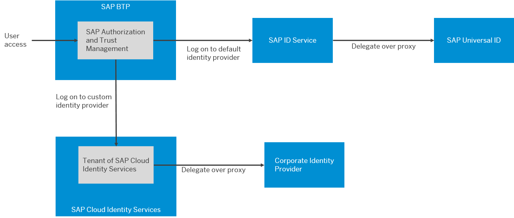

<!-- loio9c897ee8df014b3b8d7c67bab16f385c -->

# Onboard to SAP Cloud Identity Services

When setting up accounts, you need to assign users. While we provide you with your first users to get you started, your organization has identity providers that you want to integrate.

<a name="loio9c897ee8df014b3b8d7c67bab16f385c__context_md2_51s_gyb"/>

## Context

With your global account, you were provided a user to access to manage the platform. SAP BTP is preconfigured to use a default identity provider. As you begin to set up your account model, **don't** be tempted to add everyone in your organization who has a user in this identity provider.

You most likely already have your own identity and access management solution. Most importantly, in this solution you've defined your own security policies, such as password policies. The default identity provider doesn't support custom security policies. Nor does it support multifactor authentication, SCIM APIs, branding, or numerous other features.

SAP Cloud Identity Services is our solution for integrating identity and access not just with your own solution, but also across the solutions across SAP. If you didn't already have a tenant of SAP Cloud Identity Services, one was bundled with your SAP BTP account.

SAP Cloud Identity Services includes a productive tenant and test tenant. In the following figure, the left-hand landscape shows the integration of the test tenant with your development and test landscapes. This option enables you to split the users in the same way you split the business applications. The right-hand landscape shows the productive tenant integrated with your development, test, and productive landscapes. The test tenant \(not shown\) is used for evaluating and testing your identity and access management processes. Choose this option, if your business application layers require the security rules of the productive identity access management. This option reduces the effort of user management.

  
  
**Options for Integration with the Development Pipeline**

If neither of these options meet your needs, you have the freedom to define your landscape architecture yourself.

For more information about additional tenants, see [Tenant Model and Licensing](https://help.sap.com/docs/IDENTITY_AUTHENTICATION/6d6d63354d1242d185ab4830fc04feb1/93160ebd2dcb40e98aadcbb9a970f2b9.html).

> ### Recommendation:  
> We recommend that you always use SAP Cloud Identity Services - Identity Authentication as single identity provider for SAP BTP. If you use corporate identity providers, connect them to your Identity Authentication tenant, which then acts as a proxy. We especially recommend this configuration if you're using multiple corporate identity providers. For platform users, we require the use of SAP Cloud Identity Services - Identity Authentication as the custom identity provider. This configuration ensures the best integration with our services and solutions. Of course, you can use this service as a proxy for your corporate identity provider for platform users, too.
> 
>   
>   
> **Identity Providers and Federation**
> 
> 

Onboard to SAP Cloud Identity Services now.

<a name="loio9c897ee8df014b3b8d7c67bab16f385c__steps_t3d_y1s_gyb"/>

## Procedure

1.  Add a few more administrators to your SAP Cloud Identity Services tenant.

    These administrators can support the service in different time zones or if other administrators are sick or on vacation.

    For more information, see [Add Administrators](https://help.sap.com/docs/IDENTITY_AUTHENTICATION/6d6d63354d1242d185ab4830fc04feb1/bbbdbdd3899942ce874f3aae9ba9e21d.html) in the documentation of SAP Cloud Identity Services - Identity Authentication.

    > ### Tip:  
    > Unsure about which tenants you have and which administrator are assigned? Use the *SAP Cloud Identity Services - Tenants* application from the following link: [https://iamtenants.accounts.cloud.sap/](https://help.sap.com/docs/link-disclaimer?site=https%3A%2F%2Fiamtenants.accounts.cloud.sap%2F)

2.  Protect your tenant administrators with multifactor authentication.

    Administrators have critical access to the system. Set a higher security standard for authentication.

    For more information, see [Allow Users to Protect Accounts with Second Factor for Authentication](https://help.sap.com/docs/IDENTITY_AUTHENTICATION/6d6d63354d1242d185ab4830fc04feb1/d9cbb6d2fdf44819bc57e16f337b501b.html) in the documentation of SAP Cloud Identity Services - Identity Authentication.

3.  Configure system notifications and alerts for SAP Cloud Identity Services.

    For more information, see the following in the documentation of SAP Cloud Identity Services - Identity Authentication:

    -   [Send Security Alert Emails](https://help.sap.com/docs/IDENTITY_AUTHENTICATION/6d6d63354d1242d185ab4830fc04feb1/c97746478abe4a96b7a294ccc4633daa.html)

    -   [Send System Notifications via Emails](https://help.sap.com/docs/IDENTITY_AUTHENTICATION/6d6d63354d1242d185ab4830fc04feb1/aa04a8b6c60a440f866bfe30000e1e89.html)

4.  Configure SAP Cloud Identity Services - Identity Authentication as a proxy for your corporate identity provider.

    For more information, see [Corporate Identity Providers](https://help.sap.com/docs/IDENTITY_AUTHENTICATION/6d6d63354d1242d185ab4830fc04feb1/19f3eca47db643b6aad448b5dc1075ad.html).

<a name="loio9c897ee8df014b3b8d7c67bab16f385c__postreq_gvf_tgs_gyb"/>

## Next Steps

Now, you're ready to integrate SAP Cloud Identity Services with SAP BTP.

For more information, see [SAP BTP Integration Scenario](https://help.sap.com/docs/cloud-identity/system-integration-guide/sap-btp-integration-scenario) in the *System Integration Guide for SAP Cloud Identity Services*.

**Related Information**  

[What Are SAP Cloud Identity Services](https://help.sap.com/docs/cloud-identity/what-are-sap-cloud-identity-services/what-are-sap-cloud-identity-services)

