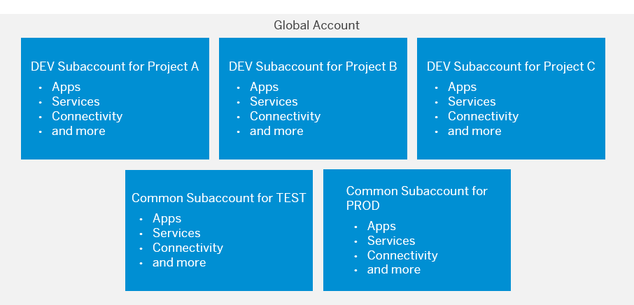

<!-- loioc7788e6549474104ad99491ad4efa245 -->

# Account Model 4: Create a Staged Development Environment Using Continuous Integration / Continuous Delivery

In this account model, a dedicated Development subaccount is created for each development project. Applications that are developed in these subaccounts are consolidated, tested, and published in one single Testing and Production subaccount.

This account model is especially well suited for companies with a focus on continuous integration and continuous delivery, as it lets every development project decide separately about their environment. A central Testing and Production subaccount ensures a high degree of governance, data security, and compliance.

In the Cloud Foundry environment, consider creating separate Development spaces in one subaccount and a dedicated Testing and Production space in a Testing and Production subaccount, respectively.

