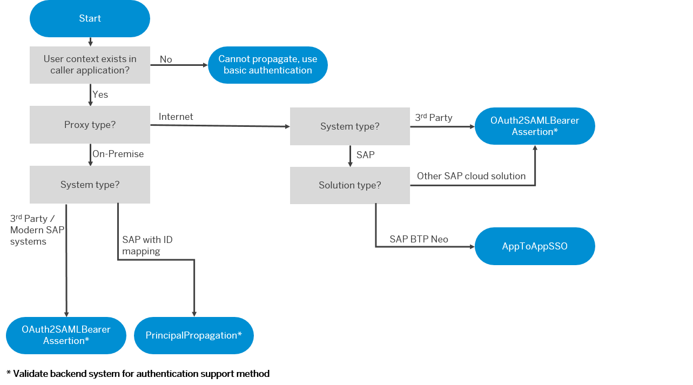
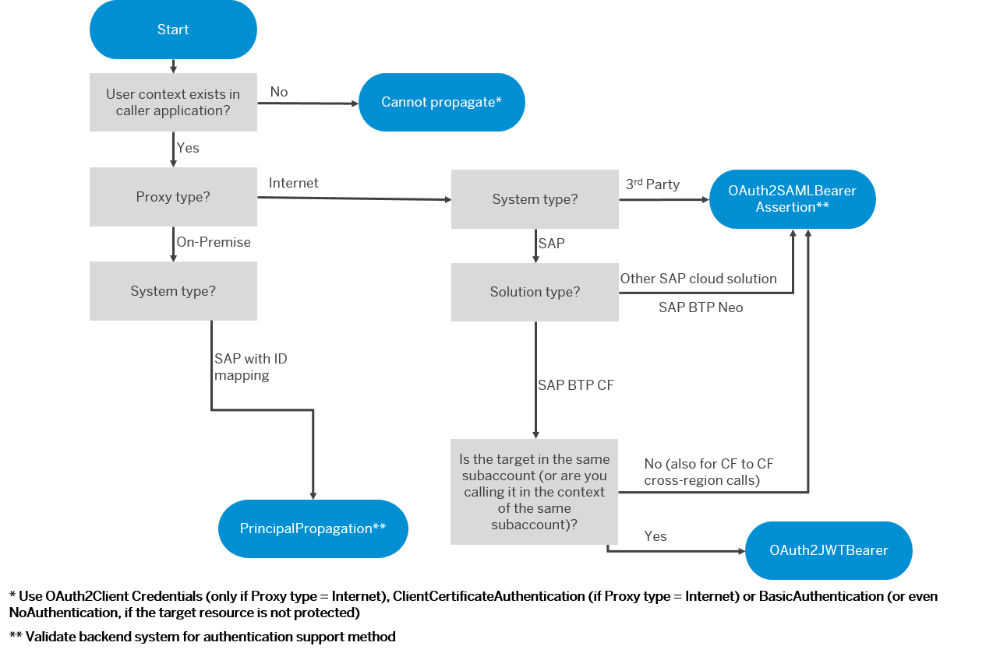

<!-- loio12cf719d12164c559b7324ee114b4733 -->

# Setting Up Identity Propagation

SAP BTP provides various options for identity propagation.

The decision trees below for the SAP BTP Neo and Cloud Foundry environments might help you identify an appropriate setup; however, these are recommendations only. Your specific setup highly depends on your use case. In general, we recommend using the PrincipalPropagation authentication type with SAP systems and OAuth2SAMLBearer Assertion with third-party systems.

   
  
<a name="loio12cf719d12164c559b7324ee114b4733__fig_h3x_1sw_42b"/>Setting Up Identity Propagation: Neo Environment

  

   
  
<a name="loio12cf719d12164c559b7324ee114b4733__fig_o1h_dps_mpb"/>Setting Up Identity Propagation: Cloud Foundry Environment

 

**Related Information**  

[Principal Propagation](https://help.sap.com/viewer/ea72206b834e4ace9cd834feed6c0e09/Cloud/en-US/f70fcf1c2d0a4a979adfe44cebc93c20.html "Exchange user ID information between systems or environments in SAP BTP.") :arrow_upper_right:

[Principal Propagation via the Cloud Connector](https://help.sap.com/viewer/cca91383641e40ffbe03bdc78f00f681/Cloud/en-US/e2cbb48def4342048362039cc157b12e.html "Enable single sign-on (SSO) by forwarding the identity of cloud users to a remote system or service (Cloud Foundry environment).") :arrow_upper_right:

[Configuring Principal Propagation to an ABAP System](https://help.sap.com/viewer/b865ed651e414196b39f8922db2122c7/Cloud/en-US/6705cc350ef44628a42473b3eb72efd8.html "Learn more about the different types of configuring and supporting principal propagation for a particular AS ABAP.") :arrow_upper_right:

[Application-to-Application SSO Authentication](https://help.sap.com/viewer/b865ed651e414196b39f8922db2122c7/Cloud/en-US/e022a5eebaec4dbbabef7f5d60e13dd4.html "") :arrow_upper_right:

