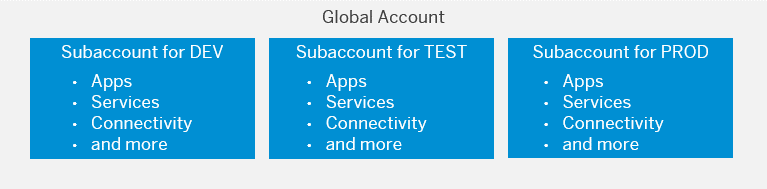
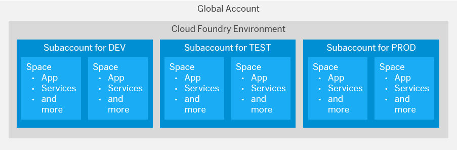

<!-- loio74eb32ef49804e6e8107338c4ed44d49 -->

# Using Subaccounts to Create a Staged Development Environment

The number of subaccounts you create, and for which purpose, depends on your organizational setup and your use case.

> ### Recommendation:  
> In general, we recommend that you create at least three subaccounts to set up a staged development environment, including one subaccount each for development, testing, and production.

-   Development – for development purposes and for testing individual increments in the cloud.
-   Testing – for integration testing and testing in production-like environment prior to making it publicly available, to ensure quality delivery. In highly DevOps-driven companies, this subaccount is also used for production applications, as testing occurs in the development subaccount.
-   Production – for production applications.

<a name="loio74eb32ef49804e6e8107338c4ed44d49__section_vsh_tks_s2b"/>

## Considerations For Creating Your Account Model

Although we recommend that you use subaccounts to create a staged development environment, you can also create subaccounts to do the following:

> ### Note:  
> If your global account is on feature set B, you can use directories to further structure your global account. See [Account Models With Directories and Subaccounts \[Feature Set B\]](Account_Models_With_Directories_and_Subaccounts_Feature_Set_B_b5a6b58.md#loiob5a6b58694784d0c9f4ff85f9b7336dd).

-   Separate development scenarios and projects to allow for easier configuration, for example, with regard to access restrictions.

-   Separate the work of different development teams.

-   Restrict access to applications and their administration, for example, by setting up "high-security" subaccounts with restricted access, or creating separate subaccounts to connect with your different back-end systems.

-   Share an SAP HANA database in one subaccount with similar projects managed in other subaccounts.

> ### Recommendation:  
> We recommend to build an account structure that can easily scale once your organization gets larger or more projects are added. To start off with one subaccount per development stage \(Account Model 5, feature set A\) or one directory that includes these three subaccounts \(Account Model 6, feature set B\) and create more such subaccounts and directories, respectively, as the need arises.

Keep in mind the following considerations when creating different subaccounts:

-   Connections to on-premise systems must be made separately for each subaccount, which also means more work for your Cloud Administration Team. However, it might be easier for you to shut down all integration paths for a project if you've maintained them all in one subaccount. This also lets you control which application uses which on-premise connections.
-   When choosing a region for your subaccount, consider that the region should be close to your customers' geographic location to reduce network latency. In extension scenarios, choose a region that's close to the systems involved. Also, consider any legal requirements and the load distribution when choosing a region.

-   If your S/4HANA tenants need to be segregated for legal or regulatory reasons \( e.g. for the segregation of subsidiaries of a company\), then you should use different subaccounts for their extensions.

-   If the DevOps or operations teams for applications within one subaccount are completely separate, you should consider creating separate subaccounts for them for better maintainability.

For information about creating subaccounts in the SAP BTP cockpit, see [Create a Subaccount](https://help.sap.com/viewer/65de2977205c403bbc107264b8eccf4b/Cloud/en-US/05280a123d3044ae97457a25b3013918.html "Create subaccounts in your global account using the SAP BTP cockpit.") :arrow_upper_right:.

<a name="loio74eb32ef49804e6e8107338c4ed44d49__section_nsz_lwq_k2b"/>

## Special Considerations for the Cloud Foundry Environment

When you enable the Cloud Foundry environment in one of your subaccounts, the system automatically creates a Cloud Foundry org for you. The subaccount and the org have a 1:1 relationship and the same navigation level in the cockpit \(even though they may have different names\). You can create spaces within that Cloud Foundry org. Spaces let you further break down your account model and use services and functions in the Cloud Foundry environment.

You can use both subaccounts and spaces to develop applications and to use services. You must therefore decide, for example, whether to create different subaccounts or spaces within one subaccount to set up a staged development environment. Consider the following:

-   Think of a subaccount as a tenant: Data access and data visibility segregation is done on subaccount level, not on application or Cloud Foundry space level. Keep in mind that services that are consumed by every app within a subaccount will gather messages from all of these services. If those should not be visible across applications, you need to create different subaccounts.

-   In general, we recommend that you create different subaccounts for a staged development environment, as shown below. This allows for dedicated user management between the different stages, as well as for dedicated data management in elastic services, such as SAP IoT Application Enablement.

-   You can then create a dedicated space for each application, extension, solution, or other project within these subaccounts if you don't need a dedicated user management for these applications and projects.

-   You can monitor the consumption of resources in your global account only per subaccount, directory, or Cloud Foundry space. Not per application. To monitor the resources consumed by a specific project, department, or application, create a dedicated subaccount, directory, or space for them.

-   Accurate billing is only possible for global accounts. For the consumption-based model, you can calculate costs according to usage, but note that this is only approximate. See [Monitoring Usage and Consumption Costs in Your Global Account](https://help.sap.com/viewer/65de2977205c403bbc107264b8eccf4b/Cloud/en-US/de6f0db8919f4e6f97e54bc4ddaf2ab8.html "In a global account that uses the consumption-based commercial model, you can monitor the usage of billed services and your consumption costs in the SAP BTP cockpit.") :arrow_upper_right:.

To decide whether to create separate subaccounts or separate spaces within the same subaccount, consider the different configuration possibilities, available for subaccounts and spaces:

<table>
<tr>
<th valign="top">

Configuration

</th>
<th valign="top">

Subaccount

</th>
<th valign="top">

Space

</th>
</tr>
<tr>
<td valign="top">

Configure your own group of business users

</td>
<td valign="top">

Yes

</td>
<td valign="top">

No

</td>
</tr>
<tr>
<td valign="top">

Configure a Cloud Connector tunnel

</td>
<td valign="top">

Yes

</td>
<td valign="top">

No

</td>
</tr>
<tr>
<td valign="top">

Configure roles and trust

</td>
<td valign="top">

Yes

</td>
<td valign="top">

No

</td>
</tr>
<tr>
<td valign="top">

Assign quotas

</td>
<td valign="top">

Yes \(mandatory\)

</td>
<td valign="top">

Yes

</td>
</tr>
</table>

See [Create Spaces](https://help.sap.com/viewer/65de2977205c403bbc107264b8eccf4b/Cloud/en-US/2f6ed22ccf424dae84345f4500c2d8ea.html "Create spaces in your Cloud Foundry organization using the SAP BTP cockpit.") :arrow_upper_right:.

<a name="loio74eb32ef49804e6e8107338c4ed44d49__section_t4w_bxq_k2b"/>

## Example Account Models

Consider the following account scenarios for creating your own account model:

-   [Account Models with Subaccounts](Account_Models_with_Subaccounts_049d331.md)
-   [Account Models With Directories and Subaccounts \[Feature Set B\]](Account_Models_With_Directories_and_Subaccounts_Feature_Set_B_b5a6b58.md#loiob5a6b58694784d0c9f4ff85f9b7336dd)

