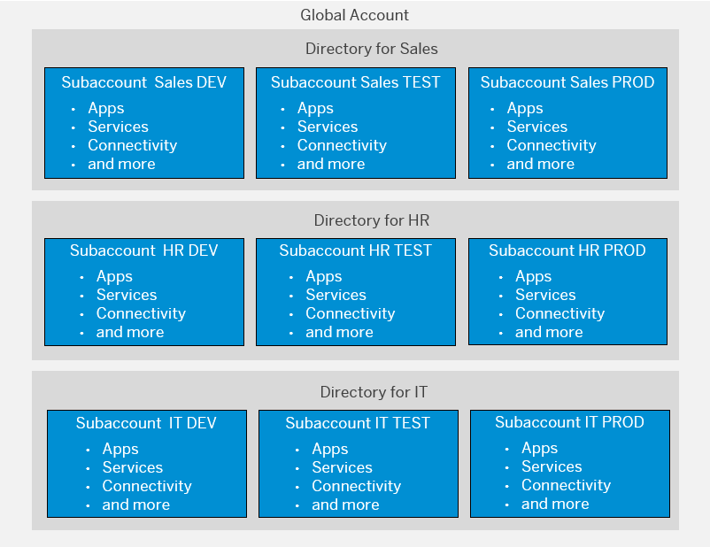
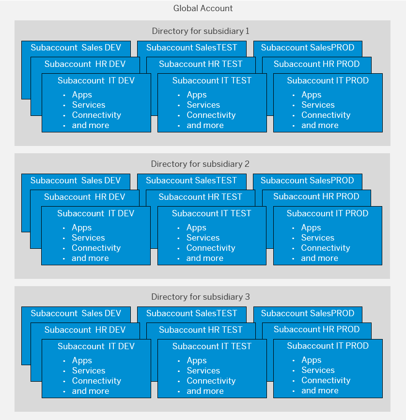

<!-- loiob5a6b58694784d0c9f4ff85f9b7336dd -->

# Account Model With Directories and Subaccounts

The account models in this section show use cases for directories as structuring elements for your subaccounts.

<a name="loiob5a6b58694784d0c9f4ff85f9b7336dd__section_h4f_bhz_fnb"/>

## Directories

Apart from structuring your global account into several subaccounts, you can group individual subaccounts into directories to manage, operate, and analyze such groups of subaccounts together. One global account can contain up to five levels of directories, which can contain n subaccounts each.

Here are a few example use cases where directories help you manage your subaccounts:

-   Administrative reasons: Structure your global account according to the responsibilities within your organization. For example, give each subsidiary, department, or LOB their own directory.

-   Billing purposes: Structure your global account into directories for accounting purposes.

-   Geographical separation: Group subaccounts based on geographical locations to manage different local regulations or to improve network performance for groups that are located together.

-   Business scenario: Group subaccounts that belong to the same business scenario or according to other business needs. This gives you the option to control each business solution separately.

-   Resource limitations: Use the directory structure to control access to resources, limit usage by generating separate usage and cost reports, or define usage limitations, to give more resources to critical directories, or to enable different monitoring per directory. Or you could structure the subaccounts according to usage limits in different landscapes.

-   Technical reasons: Structure directories and subaccounts according to technical limitation and then add labels for virtual grouping or vice versa.

<a name="loiob5a6b58694784d0c9f4ff85f9b7336dd__section_ahv_k2z_fnb"/>

## Labels

Directories and subaccounts can be tagged with **labels** for easy organizing and filtering. Also, labels can be attached to other entities in your global account, such as service instances. Think of labels as a way of virtually grouping subaccounts or directories that belong together or for which you want to create reportings.

Here are some examples of simple labels:

-   Landscape: Dev, Test, Prod

-   Department: HR, IT, Finance, Sales

-   Cost Center: 000001234, 000001235

-   Flagged for deletion

-   Important

> ### Tip:  
> Directories and labels offer two different ways of structuring subaccounts into groups. We recommend to use directories as the primary structuring mechanism and to use labels to build virtual groups of subaccounts or directories for which you need to create reports.
> 
> The suggested account models work for all runtimes. Inside a subaccount, you can further structure your projects depending on the runtime, for example, by creating Cloud Foundry spaces or Kyma namespaces.

**Related Information**  

[Labels](https://help.sap.com/viewer/65de2977205c403bbc107264b8eccf4b/Cloud/en-US/8ed4a705efa0431b910056c0acdbf377.html#loioe8663c08ead648faa673b0d63c5b478e "Labels are user-defined words or phrases that you can assign to various entities in SAP BTP to categorize them in your global account, to identify them more easily.") :arrow_upper_right:

<a name="loio9a100731c3f649e7a50a2f9c2c1af5fa"/>

<!-- loio9a100731c3f649e7a50a2f9c2c1af5fa -->

## Directories Per Functional Area

This account model uses a separate directory for each functional area.

Within each of those directories, three subaccounts \(for development, test, and production\) are created. For each directory, the functional area can use their own identity provider and manage their entitlements. Additionally, you can make use of labels, for example for the person responsible, cost center, or other aspects that you need for reportings later on.

> ### Tip:  
> For an example of naming conventions with this account model, see [Naming Conventions for SAP BTP Accounts](naming-conventions-for-sap-btp-accounts-5302ea4.md).

<a name="loiodd78c89de7b04ae4a2147edd7a811187"/>

<!-- loiodd78c89de7b04ae4a2147edd7a811187 -->

## Directories Per Location

In this account model, you create different directories for geographical areas. Additionally, for example, you can add labels to subaccounts that belong to the same departments in those locations. Alternatively, you could nest additional directories inside these ones.

<a name="loio4f6e239aa7c0485eb4a255a5101cf1f5"/>

<!-- loio4f6e239aa7c0485eb4a255a5101cf1f5 -->

## Directories Per Subsidiary

In this account model, you create directories for each subsidiary of your company. Additionally, you can add labels, for example, for cost centers or owners of the individual subaccounts or directories.

