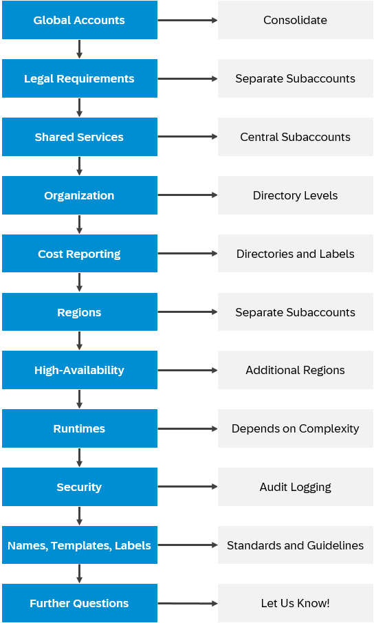
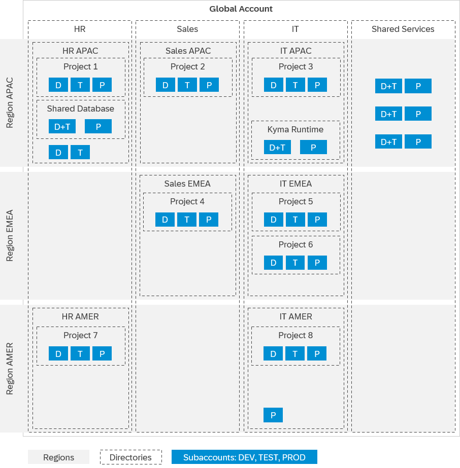

<!-- loio7f1c318292934e088e5cd119271f0b1e -->

# Checklist: Drafting Your Account Model

Before you start creating subaccounts, take the time to research and draft your desired account model. This guide helps you find out the criteria to tailor the account model to your company's needs.

## Prerequisites

-   Before you set up your account model and assign users, read [Onboard to SAP Cloud Identity Services](../onboard-to-sap-cloud-identity-services-9c897ee.md).

-   Ensure that all stakeholders, such as legal, finance or governance teams, are involved when gathering the requirements to design a sustainable account model for your organization.

-   Grab a pen and a large canvas, or even better, use the templates provided by the [BTP Solution Diagram Repository](https://sap.github.io/btp-solution-diagrams/), so you can start drafting the elements of your account model.

> ### Remember:  
> If you're still using Neo, prepare to migrate to the multi-cloud foundation. For details, see [Migrating from the Neo Environment to the Multi-Cloud Foundation for SAP BTP (Cloud Foundry and Kyma)](https://help.sap.com/viewer/b017fc4f944e4eb5b31501b3d1b6a1f0/Cloud/en-US/aae4e0ae1cdf434b908c3c8cf3ea942a.html "Learn why and how to migrate scenarios from the Neo environment to the multi-cloud foundation for SAP BTP. This guide is for SAP Business Technology Platform (SAP BTP) customers and partners with scenarios in the Neo environment that need to move to the multi-cloud foundation, including the Cloud Foundry environment or the Kyma environment.") :arrow_upper_right:.

<a name="loio7f1c318292934e088e5cd119271f0b1e__context_iks_t4w_2dc"/>

## Context

Evaluate your business and technical needs and define an account model that fits the requirements of your company. Ensure that the account model is suitable for all areas in your company.

> ### Tip:  
> Hover over the image and click the highlighted areas for more information on each individual step.

### Consolidate Global Accounts

Find out how many global accounts your company has.

If your company has more than one global account: Find out which commercial models they use, and if there are any legal or compliance constraints.

It's recommended to consolidate them, with very few exceptions, such as needing strictly separate bills \(see [Manage Provisioning of Contracts Into Global Accounts](managing-cost-c615301.md#loioc615301dc2a14e34bc6ee2216c3368b1__section_provision_contracts_into_globalaccounts)\), a contract with EU access, a HA setup with a China region, or restricting access for the global account admin.

> ### Tip:  
> If you want to move existing subaccounts from one global account to another, read [3246456](https://me.sap.com/notes/3246456).

### Check Legal Requirements

Do you need local distribution due to legal requirements per country, such as a separate subsidiary?

Create separate sets of subaccounts per legal entity and group them with directories.

For considerations on segregation and billing, see [Subaccounts or Spaces/Namespaces?](subaccounts-or-spaces-namespaces-4cb5276.md)

### Set Up Shared Subaccounts

Do you want to use SAP BTP services that can be shared to save costs or maintenance effort?

For example, consider [SAP HANA Cloud](https://help.sap.com/docs/hana-cloud/sap-hana-cloud-administration-guide/map-sap-hana-database-to-another-environment-context), SAP Integration Suite, SAP Build Work Zone, or SAP Task Center, but potentially also SAP BTP, Kyma runtime.

Create one or more central subaccounts with shared services, to which several development teams have access.

For details, see [Sharing SAP BTP Services](sharing-sap-btp-services-9fe7e16.md).

### Determine Directory Levels

Consider which criteria are relevant for your company's organization and reporting, for example:

-   Location
-   Subsidiary
-   Functional area
-   Access restrictions \(internal users vs. partners\)
-   Project
-   ...
-   Development stages \(recommended\)

At the very least, it's recommended to distinguish development stages in separate subaccounts. For details, see [The Basic Account Model](setting-up-your-account-model-2db81f4.md#loio2db81f42f5194454beecde6cd4994dda__section_basic_account_model).

Everything else is up to the requirements of your organization.

As a rule of thumb, if you differentiate by more than one criterion, use directories to structure and manage complex setups.

Determine which is the most stable criterion \(for example, location\) and choose that for the top-level directories, and within those, create more layers of directories to drill down to the granularity you need. For details, see [Directories](https://help.sap.com/viewer/65de2977205c403bbc107264b8eccf4b/Cloud/en-US/8ed4a705efa0431b910056c0acdbf377.html#loioa92721fc75524ec09a7a7255997dbd94 "With directories, you can organize and manage your subaccounts according to your technical and business needs.") :arrow_upper_right:.

You can distribute entitlements and quotas to directories and subaccounts. For details, see [Entitlements and Quotas](https://help.sap.com/viewer/65de2977205c403bbc107264b8eccf4b/Cloud/en-US/00aa2c23479d42568b18882b1ca90d79.html "When you purchase an enterprise account, you’re entitled to use a specific set of resources, such as the amount of memory that can be allocated to your applications.") :arrow_upper_right: and [Manage Resource Allocation and Avoid Over-Provisioning](managing-cost-c615301.md#loioc615301dc2a14e34bc6ee2216c3368b1__section_allocate_resources).

### Specify Directories and Labels

Do you want to report costs according to projects?

If you need reports that are different from how your subaccounts and directories are divided, assign labels.

For details, see [Monitor Usage and Cost](managing-cost-c615301.md#loioc615301dc2a14e34bc6ee2216c3368b1__section_monitor_usage_and_cost).

### Select Regions

In which regions would you like to deploy your applications? Choosing a nearby region may reduce lag.

A region is chosen at the subaccount level. For each subaccount, you select exactly one region.

For details, see [Regions](https://help.sap.com/viewer/65de2977205c403bbc107264b8eccf4b/Cloud/en-US/350356d1dc314d3199dca15bd2ab9b0e.html "You can deploy applications in different regions. Each region represents a geographical location (for example, Europe, US East) where applications, data, or services are hosted.") :arrow_upper_right:.

### Choose HA Regions

Do you want a high-availability setup?

-   If in the same region, you can use the same Cloud Foundry space.
-   If in a different region, you need a separate subaccount.
-   If you need a China region, you must set up a separate global account.

### Decide Runtime Setup

Do you want to use more than one runtime?

Are you wondering whether you can share subaccounts or rather use a new subaccount for each runtime?

For details, see [Cloud Foundry, Kyma, or Both?](cloud-foundry-kyma-or-both-ec8a269.md).

### Set Up Audit Logging

Do you have projects with special security requirements? Do you want to log activities on SAP BTP, for example, who created a service instance, or who gave permissions to services?

To do all this, set up audit logging.

For details, see [Audit Logging in the Cloud Foundry Environment](https://help.sap.com/viewer/65de2977205c403bbc107264b8eccf4b/Cloud/en-US/f92c86ab11f6474ea5579d839051c334.html "In this section, you can find information for audit log functionalities in the Cloud Foundry environment.") :arrow_upper_right: and [Auditing and Logging Information in Kyma](https://help.sap.com/viewer/65de2977205c403bbc107264b8eccf4b/Cloud/en-US/935e241ca726412597175bef2add8c57.html "Kyma runtime collects audit and application logs.") :arrow_upper_right:.

### Agree on Standards and Guidelines

Define an account hierarchy and naming conventions and, if needed, a standardized process for account creation.

Agree on the labels you want to use in your organization.

For details, see [Naming and Directory Templates](naming-and-directory-templates-5302ea4.md).

Roll out the standards and guidelines to pilot teams and refine your account model based on their feedback.

### Let Us Know!

Does your company have requirements that aren't considered in this list?

Use the *Feedback* functionality and we'll improve the guide as soon as possible.

> ### Remember:  
> SAP Cloud ALM is provisioned in a separately created global account, with a subaccount that contains your SAP Cloud ALM subscription. You can't subscribe to any additional applications in this subaccount beyond those provided by SAP together with SAP Cloud ALM, as the subaccount is set up exclusively for SAP Cloud ALM. You can't consolidate this special global account with your company's accounts.

With the information you gathered, start drafting your account model:

<a name="loio7f1c318292934e088e5cd119271f0b1e__steps_krj_v4w_2dc"/>

## Procedure

1.  If you need to have more than one **global account**, divide your drafting area accordingly and follow the next steps as applicable for each global account.

2.  If there are **legal or compliance requirements** for isolation between legal entities or subsidiaries of your organization, split your draft accordingly.

    To set up strict isolation, you need separate subaccounts - see [Subaccounts or Spaces/Namespaces?](subaccounts-or-spaces-namespaces-4cb5276.md)

    In some cases, you might even have to set up separate global accounts to fulfill **legal or compliance requirements**.

3.  In your draft, reserve place for one or more dedicated \(central\) subaccounts for **shared services**.

    For details, see [Sharing SAP BTP Services](sharing-sap-btp-services-9fe7e16.md).

4.  If you want a more complex structure than just one subaccount per development stage, draw areas for the directory levels associated to your most high-level **organizational criteria** and within those, place the required subaccounts.

    For example, divide your draft into columns for the primary directories and within those, create areas for the lower-level criteria, which will contain the subaccounts.

5.  For **cost reporting**, you can use directories as well as labels. If you need reports that are different from how your subaccounts and directories are divided, assign a label for each report to the respective subaccounts or directories.

    For details, see [Monitor Usage and Cost](managing-cost-c615301.md#loioc615301dc2a14e34bc6ee2216c3368b1__section_monitor_usage_and_cost).

6.  If your applications must be deployed in different **regions**, split your draft accordingly. You are going to have to create separate subaccounts in each region, even if all the other criteria are the same.

7.  For a **high-availability** setup, the account model depends on the region where you set up your fallback:

    -   If in the same region, you can use the same Cloud Foundry space.
    -   If in a different region, you need a separate subaccount.
    -   If you need a China region, you must create a separate global account.

8.  If you want to use more than one runtime, choose your approach:

    -   You can either set up one or more subaccounts that run **both** **runtimes**, Cloud Foundry and Kyma, so that they can share SAP BTP services, such as SAP HANA Cloud.
    -   Alternatively, if your account model needs more complexity than just development stages, it's recommended to create one or more subaccounts specifically for Kyma, which can be shared between your teams. For details, see [Sharing Clusters in Kyma](sharing-clusters-in-kyma-57ec1ea.md). Cost optimization is easier if you have only one runtime per subaccount.

    For details, see [Cloud Foundry, Kyma, or Both?](cloud-foundry-kyma-or-both-ec8a269.md).

9.  If you have **security** requirements that demand activity logging, set up audit logging.

    For details, see [Audit Logging in the Cloud Foundry Environment](https://help.sap.com/viewer/65de2977205c403bbc107264b8eccf4b/Cloud/en-US/f92c86ab11f6474ea5579d839051c334.html "In this section, you can find information for audit log functionalities in the Cloud Foundry environment.") :arrow_upper_right: and [Auditing and Logging Information in Kyma](https://help.sap.com/viewer/65de2977205c403bbc107264b8eccf4b/Cloud/en-US/935e241ca726412597175bef2add8c57.html "Kyma runtime collects audit and application logs.") :arrow_upper_right:.

10. Define an account **hierarchy and guidelines**, and roll them out to a few pilot project managers to get their feedback.

    -   Ensure that each hierarchy \(global account, directories, subaccounts, spaces/namespaces/packages\) is owned by a team that takes responsibility for administrative processes and tasks. See [Creating a Governance Model](creating-a-governance-model-bf0ce2c.md) and [Administrative Tasks](../basic-platform-concepts/basic-platform-concepts-38ecf59.md#loio38ecf59cdda64150a102cfaa62d5faab__section_ozn_1cx_ywb).

    -   Define naming conventions. Optionally, create a process for the creation of new directories. See [Naming and Directory Templates](naming-and-directory-templates-5302ea4.md).

    -   Define labels and values according to the reports that you want to create. See [Labels](https://help.sap.com/viewer/65de2977205c403bbc107264b8eccf4b/Cloud/en-US/8ed4a705efa0431b910056c0acdbf377.html#loioe8663c08ead648faa673b0d63c5b478e "Labels are user-defined words or phrases that you can assign to various entities in SAP BTP to categorize them in your global account, to identify them more easily.") :arrow_upper_right:.

11. If you have **questions** that aren't covered in this list, give us feedback and we'll improve the guide as soon as possible.

    For details, see [Contribute to This Guide](../intro/sap-btp-administrator-s-guide-9f2bb92.md#loio9f2bb927464e4d1ba3d13b2d79ca9bd1__section_qrh_kyc_r1c).

<a name="loio7f1c318292934e088e5cd119271f0b1e__result_yc5_3pw_2dc"/>

## Results

Your account model draft could look like this:

> ### Remember:  
> Staged development is recommended; but that doesn't mean all teams or projects need exactly one DEV, TEST, and PROD environment each. Create only the subaccounts and runtimes you really need; you can always create more later.

<a name="loio7f1c318292934e088e5cd119271f0b1e__postreq_bl1_q5w_2dc"/>

## Next Steps

-   Familiarize yourself with the different tools you can use for account administration. For details, see [Tools for Account Administration](tools-for-account-administration-6bdb3a7.md#loio6bdb3a7170b84254bfaf0df52a112980).

-   Based on your research and the account model draft, roll out the agreed account standards, directory template, and naming conventions to the designated administrators, and start creating the required subaccounts.

-   If you need a hybrid setup with on-premise systems and SAP BTP, set up a cloud connector. For details, see [Setting Up Access to Remote Systems](setting-up-access-to-remote-systems-9d65539.md).

