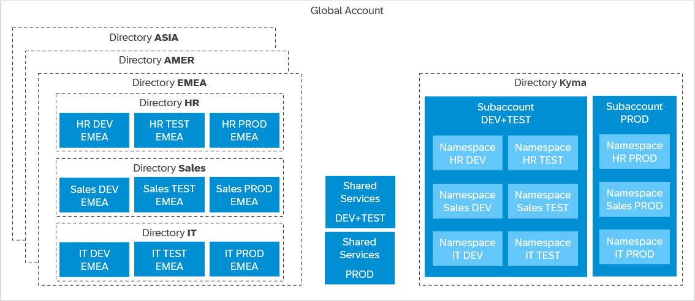

<!-- loioec8a269c4312416dbb83deb9e5b6bc5b -->

# Cloud Foundry, Kyma, or Both?

You can set up one or more subaccounts that run both Cloud Foundry and Kyma, so that they can share SAP BTP services, such as SAP HANA Cloud. However, if your account model needs more complexity than just development stages, it's recommended to create one or more subaccounts specifically for Kyma, which can be shared between your teams.

> ### Remember:  
> The ABAP environment allows you to create extensions for ABAP-based products, such as SAP S/4HANA Cloud, and develop new cloud applications. You can transform existing ABAP-based custom code or extensions to the cloud.

Regardless of whether you are new to SAP BTP and are trying to pick the runtime that matches your organization's needs \(greenfield scenario\), or you've been using SAP BTP for a while and looking to use more than your current runtime \(brownfield scenario\), the following recommendations should help you make the right choice. And don't worry, no matter what you choose now, you can always adjust your landscape later.

<a name="loioec8a269c4312416dbb83deb9e5b6bc5b__section_rhy_5sb_fdc"/>

## Greenfield Scenario: A New Development Landscape

In the cloud \(just like on premise\), we recommend a **staged development process**, to qualify changes before bringing them to production. For details, see [Setting Up Your Account Model](setting-up-your-account-model-2db81f4.md).

Cloud Foundry and Kyma offer parity with regards to non-functionals. Both bring multi-availability-zone infrastructure support and the same SLA levels. The difference and the main decision point is your application architecture, driven by business aspects. For details about the runtimes as well as the required developer skillset, see [Comparison: SAP BTP, Kyma Runtime and SAP BTP, Cloud Foundry Runtime](https://help.sap.com/docs/BTP/8cc4e6b957be41d0b7a07680d1d9bb07/de5c964bd17443409e11c55f4f5dacb7.html?locale=en-US).

> ### Recommendation:  
> -   In Cloud Foundry, we recommend that you create three subaccounts to set up a staged development environment: one subaccount each for development, testing, and production. To do so, you create subaccounts and enable Cloud Foundry, which essentially creates a Cloud Foundry org.
> 
> -   In Kyma, we recommend using at least two separate subaccounts to set up a staged development environment: one for development and testing \(separated by using different namespaces\), and one for production. Within those clusters, set up namespaces according to your projects or organizational setup, such as for Sales and Logistics. For details, see [Sharing Clusters in Kyma](sharing-clusters-in-kyma-57ec1ea.md). Ideally, you use a separate third cluster for testing. However, if cost-efficiency is important, one subaccount may be enough.

The subaccount and the Cloud Foundry org or Kyma cluster have a 1:1 relationship and the same navigation level in SAP BTP cockpit \(even though they may have different names\). Enabling Cloud Foundry creates a Cloud Foundry org, and enabling Kyma creates a Kyma cluster.

Typically, some additional systems are also part of the landscape:

-   Identity provider, like SAP Cloud Identity Services. For details, see [Onboard to SAP Cloud Identity Services](../onboard-to-sap-cloud-identity-services-9c897ee.md) and [Configuring a Custom Identity Provider for Kyma](https://help.sap.com/viewer/65de2977205c403bbc107264b8eccf4b/Cloud/en-US/67bcc6e2d4d749659faf3ede1853f19e.html "Enable the Kyma environment with a custom identity provider (IdP).") :arrow_upper_right:.

-   Pipeline system, like [SAP Continuous Integration and Delivery](https://help.sap.com/docs/CONTINUOUS_DELIVERY).

-   SAP BTP service instances and app subscriptions, for example, SAP HANA, SAP Audit Log, or SAP Destination service.

<a name="loioec8a269c4312416dbb83deb9e5b6bc5b__section_v41_nsb_fdc"/>

## Brownfield Scenario: Combining Cloud Foundry and Kyma 

Maybe you are currently using Cloud Foundry and would like to start using Kyma as well – to use new services, to migrate some services from Cloud Foundry to Kyma, or generally to benefit from the features of the Kubernetes-based runtime, such as higher flexibility.

Such approaches always require finding a balance between flexibility and costs. In some cases, using the same subaccount for Cloud Foundry and Kyma for the same landscape makes sense: This way, you can reuse or share some SAP BTP services, for example, SAP HANA Cloud. In this example, one recommendation could be having the same PROD subaccount for both Cloud Foundry and Kyma. But for DEV and TEST, you might choose to create separate subaccounts.

However, if your existing subaccount landscape is more complex and you have several teams, each with multiple subaccounts, then it's recommended to create a shared subaccount for SAP BTP, Kyma runtime, to which the teams get access. Instead of subaccounts, use namespaces for isolation - for details, see [Sharing Clusters in Kyma](sharing-clusters-in-kyma-57ec1ea.md).

**Related Information**  

[Create Spaces](https://help.sap.com/viewer/65de2977205c403bbc107264b8eccf4b/Cloud/en-US/2f6ed22ccf424dae84345f4500c2d8ea.html "Create spaces in your Cloud Foundry organization using the SAP BTP cockpit. In a space, you can deploy and maintain applications, and connect them to services.") :arrow_upper_right:

[Kubernetes Namespaces](https://kubernetes.io/docs/concepts/overview/working-with-objects/namespaces/)

[Subaccounts or Spaces/Namespaces?](subaccounts-or-spaces-namespaces-4cb5276.md "Within subaccounts, you can further break down your account model: In a Cloud Foundry org, you create “spaces”; in a Kyma cluster, you create “namespaces”. You can use both, subaccounts and spaces/namespaces, to develop applications and to use services and functions.")

