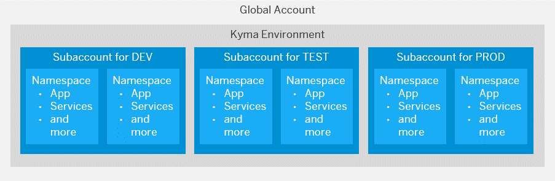

<!-- loioec8a269c4312416dbb83deb9e5b6bc5b -->

# Considerations for the Kyma Environment

While creating a staged development environment is a good idea in any case, there are some considerations specific to Kyma you might want to take into account.

> ### Recommendation:  
> In SAP BTP, Kyma runtime, each subaccount corresponds to provisioning one cluster. We recommend to use at least two separate clusters, one for development \(including testing\) and one for production, and within those clusters, set up namespaces according your organizational setup or projects. Ideally, you use a separate third cluster for testing. If cost-efficiency is important, one subaccount may be enough.

When you enable the Kyma environment in one of your subaccounts, the system automatically creates a Kubernetes cluster equipped with the latest version of the open-source project "Kyma" for you. The subaccount and the Kyma cluster have a 1:1 relationship and the same navigation level in the cockpit \(even though they may have different names\). You can create namespaces within that Kyma cluster. Namespaces let you further break down your account model and use services and functions in the Kyma environment. For more information, see the Kubernetes documentation at [https://kubernetes.io/docs/concepts/overview/working-with-objects/namespaces/](https://kubernetes.io/docs/concepts/overview/working-with-objects/namespaces/).

You can use both subaccounts and namespaces to develop applications and to use services. You must therefore decide, for example, whether to create different subaccounts or namespaces within one subaccount to set up a staged development environment. Consider the following:

-   Think of a subaccount as a tenant: Data access and data visibility segregation is done on subaccount level, not on application or Kyma namespace level. Keep in mind that services that are consumed by every app within a subaccount will gather messages from all of these services. If those should not be visible across applications, you need to create different subaccounts.

-   In general, we recommend that you create different subaccounts for a staged development environment. This allows for dedicated user management between the different stages, as well as for dedicated data management in elastic services, such as SAP IoT Application Enablement.

-   You can then create a dedicated namespace for each application, extension, solution, or other project within these subaccounts if you don't need a dedicated user management for these applications and projects.

-   You can monitor the consumption of resources in your global account only per subaccount, directory, or Kyma namespace. Not per application. To monitor the resources consumed by a specific project, department, or application, create a dedicated subaccount, directory, or namespace for them.

-   Accurate billing is only possible for global accounts. For the consumption-based model, you can calculate costs according to usage, but note that this is only approximate. See [Monitoring Usage and Consumption Costs in Your Global Account](https://help.sap.com/viewer/65de2977205c403bbc107264b8eccf4b/Cloud/en-US/de6f0db8919f4e6f97e54bc4ddaf2ab8.html "In a global account that uses the consumption-based commercial model, you can monitor the usage of billed services and your consumption costs in the SAP BTP cockpit.") :arrow_upper_right:.

To decide whether to create separate subaccounts or separate namespaces within the same subaccount, consider the different configuration possibilities, available for subaccounts and spaces:

<table>
<tr>
<th valign="top">

Configuration

</th>
<th valign="top">

Subaccount

</th>
<th valign="top">

Namespace

</th>
</tr>
<tr>
<td valign="top">

Configure your own group of business users

</td>
<td valign="top">

Yes

</td>
<td valign="top">

No

</td>
</tr>
<tr>
<td valign="top">

Configure a Cloud Connector tunnel

</td>
<td valign="top">

Yes

</td>
<td valign="top">

No

</td>
</tr>
<tr>
<td valign="top">

Configure roles and trust

</td>
<td valign="top">

Yes

</td>
<td valign="top">

No

</td>
</tr>
<tr>
<td valign="top">

Assign quotas

</td>
<td valign="top">

Yes \(mandatory\)

</td>
<td valign="top">

Yes

</td>
</tr>
</table>

