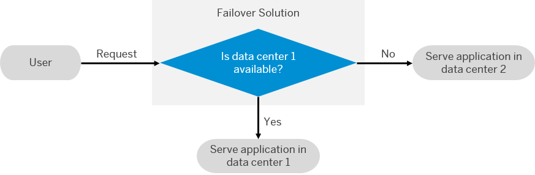

<!-- loio8c46464783664ac4a748e70a91e08508 -->

# Planning Failover on SAP BTP

Use a multi-data center setup and implement automatic failover to ensure the high availability of your applications in case of a data center outage.

Together with [Implementing Failover](../deploy-and-deliver/implementing-failover-df972c5.md), this chapter helps you implement a basic automated failover for SAPUI5 and HTML5 applications in a multi-data center setup. The failover approach ensures that your business-critical applications continue working in case of an unexpected downtime in an SAP BTP data center or SAP BTP Portal.

> ### Restriction:  
> At the moment, these chapters are only valid for SAPUI5 and HTML5 applications without data persistence or any kind of in-memory caching, whose data is stored in on-premise back-end systems.

<a name="loio8c46464783664ac4a748e70a91e08508__section_tdm_2qr_yhb"/>

## What is Failover

Failover is an approach to ensure the high availability of your applications.

Generally, the term denotes the automated process of switching from one server, network, or system to another redundant one in case of an either unexpected or planned downtime. If the primary server, network, or system is unavailable, the traffic is redirected to the secondary one, which takes over the tasks. Therefore, both functionality and availability of your application is maintained.

The following figure illustrates this concept for a mutli-data center setup, as described in this guide:

  
  
**Failover in Multi-DC Setup**

The SAP BTP Failover Guide focuses on four principles to consider when planning a failover:

### Deploy Your Application in Two Data Centers

Our guide focuses on a multi-data center setup in which you deploy your application in two different data centers in parallel. The described setup is active/passive, which means that the traffic is generally directed to the application in the primary \(active\) data center. Only if the active data center experiences a downtime, the traffic is redirected to the application in the secondary \(passive\) one.

For more information, see [Deploy Your Application in Two Data Centers](https://help.sap.com/viewer/2c674b8190ef4978ba40ba8283cf5adb/Cloud/en-US/61d08d8c85f448a0b7399e83f01a1a04.html "Deploy your application in two data centers in parallel so that in case of an issue, you can switch from one to the other.") :arrow_upper_right:.

### Keep the Two Applications in Sync

To maintain the functionality of your application, make sure that both applications in the primary and the secondary data center are kept in sync. In this guide, we consider three different ways to orchestrate your applications:

-   Orchestrate your applications manually. See [Synchronize Your Applications Manually](https://help.sap.com/viewer/2c674b8190ef4978ba40ba8283cf5adb/Cloud/en-US/e6d2bdb006734bd69e394379ff0dd956.html#loio5606f91c66b44354bd99cce0a0b9da5d "") :arrow_upper_right:.

-   Orchestrate your applications with the help of a continuous integration and delivery pipeline. See [Use a Continuous Integration and Delivery Pipeline](https://help.sap.com/viewer/2c674b8190ef4978ba40ba8283cf5adb/Cloud/en-US/e6d2bdb006734bd69e394379ff0dd956.html#loioe603c7411eb0483eaeda10fee8aacb5b "") :arrow_upper_right:.

-   Orchestrate your applications through a combination of the Solution Export Wizard and the SAP BTP Transport Management service. See [Use the Solution Export Wizard and SAP Cloud Transport Management](https://help.sap.com/viewer/2c674b8190ef4978ba40ba8283cf5adb/Cloud/en-US/e6d2bdb006734bd69e394379ff0dd956.html#loio8b3131f1b7504bc7b8a2e1e8b46f71f0 "You can orchestrate your applications through a combination of the solution export wizard and the SAP Cloud Transport Management service.") :arrow_upper_right:.

For more information, see [Keep the Two Applications in Sync](https://help.sap.com/viewer/2c674b8190ef4978ba40ba8283cf5adb/Cloud/en-US/e6d2bdb006734bd69e394379ff0dd956.html#loioe6d2bdb006734bd69e394379ff0dd956 "Synchronize your applications in both data centers to maintain their functionality in case of a downtime.") :arrow_upper_right:.

### Define How a Failover Is Detected

To implement an automated failover from one data center to another, you must specify the cases in which the automatic switch has to be performed. You can choose from several options that vary in both their setup effort and flexibility, and use, for example, arbiters and different monitoring tools. In this guide, we describe a basic scenario, in which a user request triggers checks for both error codes and inappropriate response times.

For more information, see [Define How a Failover Is Detected](https://help.sap.com/viewer/2c674b8190ef4978ba40ba8283cf5adb/Cloud/en-US/88b86dbbbee34092a2e30a32ada5dc19.html "Define in which cases the automatic failover from one data center to the other is triggered.") :arrow_upper_right:.

### Decide on the Failback

Depending on your failover setup, a failback to the primary data center is either required or optional. In our active/passive scenario, the failback is mandatory and performed by the user himself. Additionally, we recommend to visually differentiate between the applications in the primary and the secondary data center so that the user is constantly reminded of the necessity to switch back as soon as the primary data center is available again.

For more information, see [Decide on the Failback](https://help.sap.com/viewer/2c674b8190ef4978ba40ba8283cf5adb/Cloud/en-US/963f9622c81b4161b9c34cc42069f320.html "In the setup of your failover scenario, define whether a failback is needed and how it is performed.") :arrow_upper_right:.

**Related Information**  

[Developing Resilient Applications](https://help.sap.com/docs/BTP/0c8c1db388f645159e134a005aaabbcf/b1b929a5aea64571b2f74e810b622568.html?locale=en-US)

