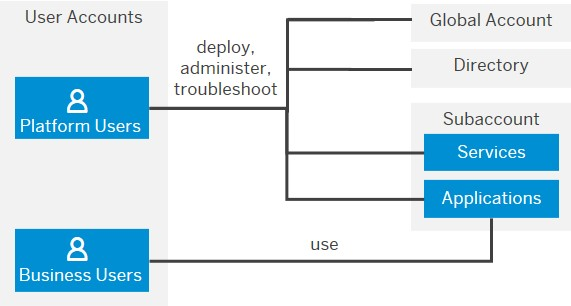
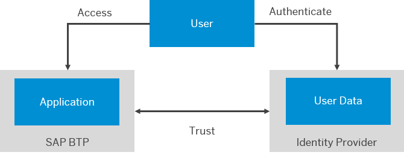
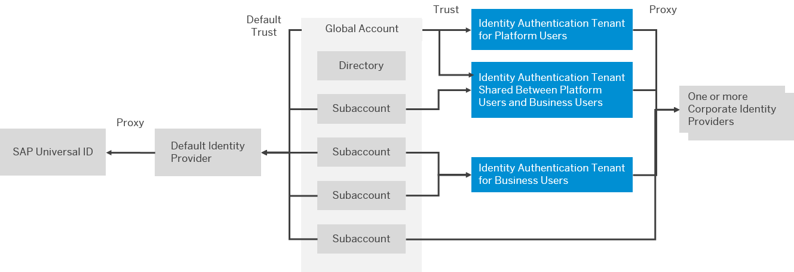

<!-- loio951d36ce07324f919f74f52b0f9f9e0a -->

# Security Concepts

The level of security you implement varies depending on your use case and your company's general security requirements. However, there are a few best practices that we recommend, regardless of your implementation.

<a name="loio951d36ce07324f919f74f52b0f9f9e0a__section_dx2_bwv_p5b"/>

## SAP BTP Security Recommendations

*SAP BTP Security Recommendations* collects information, which enables you to secure the configuration and operation of SAP BTP services in your landscape.

For more information, see [SAP BTP Security Recommendations](https://help.sap.com/docs/BTP/c8a9bb59fe624f0981efa0eff2497d7d/531f33def8074ccdb6f1f784a34dafcb.html?version=Cloud).

<a name="loio951d36ce07324f919f74f52b0f9f9e0a__section_jp5_q4n_cgb"/>

## Network Security Aspects

The SAP BTP landscape runs in an isolated network that is protected from the outside by firewalls, a DMZ, and communication proxies for all inbound and outbound communication. All user access is protected with transport layer security \(TLS\).

For more information, see [Transport Layer Security \(TLS\) Connectivity Support](https://help.sap.com/docs/btp/sap-business-technology-platform/btp-security?version=Cloud#transport-layer-security-(tls)-connectivity-support).

<a name="loio951d36ce07324f919f74f52b0f9f9e0a__section_ofg_qzg_1yb"/>

## User and Member Management

On SAP BTP, member management happens at all levels from global account to environment, while user management is done for business applications.

Before diving into the different user and member management concepts, it's important to understand the difference between the different types of users we’re referring to: **Platform users** and **business users**.

  
  
**Platform and Business Users**

-   **Platform users** are usually developers, administrators or operators who deploy, administer, and troubleshoot applications and services on SAP BTP. They’re the users that you give certain permissions for instance at global account or subaccount level, by adding them as members.

    **Member management** refers to managing permissions for **platform users**. You can think about it as managing the members of your team.

    Member management happens at global account, directory, subaccount, and environment level. Members' permissions apply to all operations that are associated with the global account, the organization, or the space, irrespective of the tool used. Depending on the scope you're using, you manage members in different ways.

-   **Business users** use the applications that are deployed to SAP BTP. For example, the end users of SaaS apps or services, such as SAP Workflow service or SAP Cloud Integration, or end users of your custom applications are business users.

Restrict access to applications through authentication and authorization. Identity and authorization management ensures that only the intended group, such as employees of your company, can access your applications.

Global accounts and subaccounts get their users from identity providers. There's a default identity provider or administrators can configure custom identity providers. Administrators decide which identity providers to trust and grant access rights to users from these identity providers. You have full control over your user base.

<a name="loio951d36ce07324f919f74f52b0f9f9e0a__section_jm5_1nw_jgb"/>

## Identity Providers and Federation

SAP BTP supports identity federation, a concept of linking and reusing digital identities of a user base across loosely coupled systems. Identity federation frees applications on SAP BTP as well as the platform itself from the need to obtain and store the credentials of users and to authenticate them. Instead, the user base is reused from identity providers, which support the administration of digital user identities, authentication, and authorizations in a centralized and decoupled manner. To enable communication between SAP BTP and identity providers, you must cross-configure the communication endpoints of the involved systems, establishing a trust relationship between them.

  
  
**Identity Federation**

The two types of users on SAP BTP, platform users and business users, have separate trust configurations for identity providers. Platform users share one or more identity providers configured for the global account and further apply to the directory, subaccount, and the environment levels. Business users use the identity provider configured individually for each subaccount.

The following figure shows the default trust configuration for SAP BTP as well as a possible custom configuration for platform and business users.

  
  
**Trust Relationship Between SAP BTP and Identity Providers**

> ### Note:  
> Some services have their own user store or trust configuration. For the ABAP environment, business users reside in the ABAP user store. SAP HANA Database users have their own user store. The Kyma environment has a separate trust configuration from the subaccount.

Once a user is authenticated, single sign-on enables the user to log on to other trusted applications without reauthenticating. Principal propagation enables applications to pass credentials to back-end systems without requiring the user to reauthenticate. For technical users, principal propagation isn't needed for back-end access.

