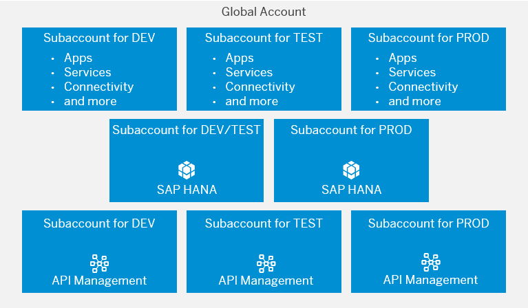

<!-- loioc973258cbb9a4e399b0d5ec988ead034 -->

# Separate Subaccounts for Data and API Management

In this scenario, the IT department of an organization manages separate subaccounts for data isolation and for reuse of API management and connectivity. The department also creates dedicated \(staged\) subaccounts for development projects.

Access to back-end systems is managed centrally by the IT department via API management in three dedicated subaccounts. Every new development project uses separate subaccounts \(one each for Development, Test, and Production\) that consumes the APIs that are managed in these subaccounts via destinations. In addition, SAP HANA databases are deployed in two dedicated subaccounts – Development/Testing and Production – and shared across different subaccounts.

The advantages of this model are that it allows you to scale quickly while ensuring that connections to your back-end systems are always established via APIs; it also keeps costs low \(due to the sharing of the SAP HANA databases across subaccounts\).

This account model can also easily be expanded for the use of directories: For example, you could combine each row in the figure above into a directory, and once you have more than one line of business or department that needs a dev, test, and prod subaccount, you could create new directories. That way, you would have directories for lines of businesses/departments and for functional areas \(such asdata management or central IT tools\). See [Account Model With Directories and Subaccounts](account-model-with-directories-and-subaccounts-b5a6b58.md#loiob5a6b58694784d0c9f4ff85f9b7336dd).

