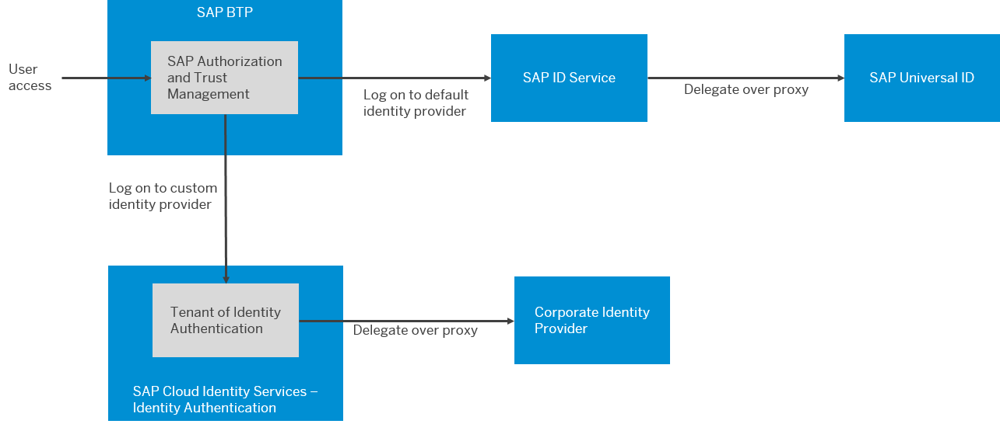

<!-- loio1dbce9caa4314103bbc9a7e3ca548280 -->

# Setting Up Authentication

Your initial access to SAP BTP depends on the default identity provider. After consuming the initial starter scenarios and testing, switch to integrating your own identity and access management solution, where you have control over your own security policies.

We recommend that you always use SAP Cloud Identity Services - Identity Authentication for SAP BTP. If you use corporate identity providers, connect them to your Identity Authentication tenant, which then acts as a proxy. We especially recommend this configuration if you're using multiple corporate identity providers. Avoid trusting your corporate identity provider directly. The use of Identity Authentication is mandatory for platform users or for the use of some applications, such as SAP Build Work Zone and SAP Build Apps for your business users. ABAP-based public cloud solutions require Identity Authentication, too. Identity Authentication is the central integration point for managing identities across all SAP solutions. The support of SAML and OpenID Connect \(OIDC\) eases integration and consumption.

For more information, see [Onboard to SAP Cloud Identity Services](../onboard-to-sap-cloud-identity-services-9c897ee.md)

  
  
**Identity Providers and Federation**

> ### Remember:  
> The two types of users on SAP BTP, platform users and business users, have separate trust configurations for identity providers. Platform users share one or more identity providers configured for the global account and further apply to the directory, subaccount, and the environment levels. Business users use the identity provider configured for each subaccount.

To establish trust for platform and business users, see the following:

-   [Establish Trust and Federation of Custom Identity Providers for Platform Users \[Feature Set B\]](https://help.sap.com/docs/BTP/65de2977205c403bbc107264b8eccf4b/c36898473d704e07a33268c9f9d29515.html)

-   [Establish Trust and Federation Between UAA and Identity Authentication](https://help.sap.com/docs/BTP/65de2977205c403bbc107264b8eccf4b/161f8f0cfac64c4fa2d973bc5f08a894.html)

> ### Recommendation:  
> For platform users, keep a few backup administrators in the default identity provider or in an additional custom identity provider. Use these backup administrators in case access to your primary custom identity provider fails.

<a name="loio1dbce9caa4314103bbc9a7e3ca548280__section_wfk_fbw_1yb"/>

## Default Identity Providers

SAP ID service is the preconfigured user store you can use in your starter scenarios or for testing. SAP ID service is the place where you register to get initial access to SAP BTP.

SAP Universal ID manages the users of official SAP sites, including the SAP developer and partner community. If you already have such a user, then you're already registered with SAP ID service as well. SAP ID service acts as a proxy for SAP Universal ID, when users log on with their email addresses. Users can log on with and manage all their user accounts with SAP Universal ID.

<a name="loio1dbce9caa4314103bbc9a7e3ca548280__section_kzx_hyw_dyb"/>

## Identity Providers and SAP BTP Environments

The Kyma environment has a separate configuration for the identity provider. We recommend that you also configure your Kyma environment to use Identity Authentication as your custom identity provider.

For more information, see [Configure a Custom Identity Provider for Kyma](https://help.sap.com/docs/BTP/65de2977205c403bbc107264b8eccf4b/67bcc6e2d4d749659faf3ede1853f19e.html).

