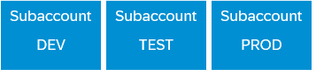
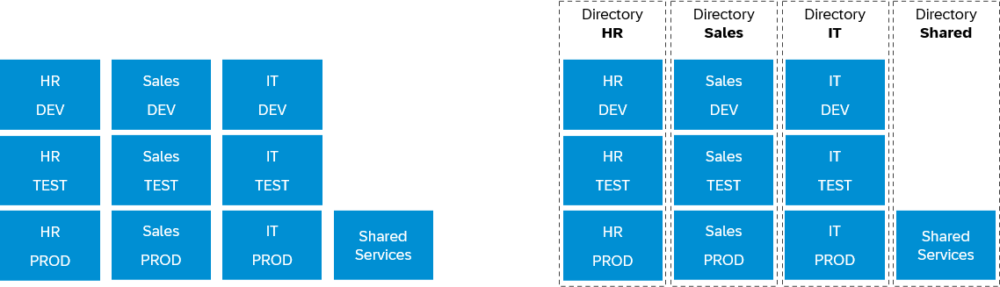
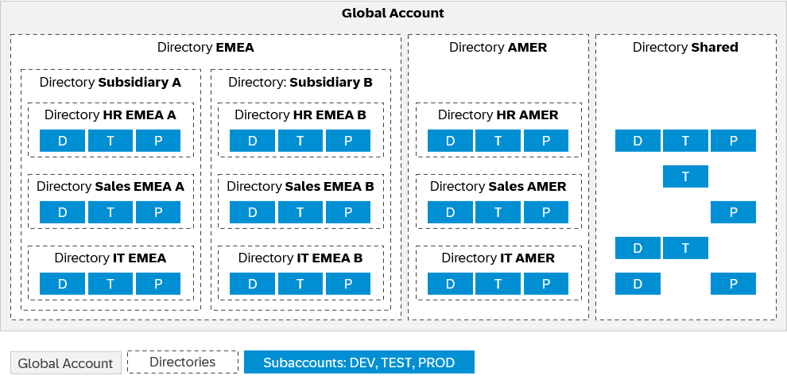

<!-- loio2db81f42f5194454beecde6cd4994dda -->

# Setting Up Your Account Model

Learn how to set up your account model with global accounts and subaccounts, and how to use directories, spaces and namespaces to match your business and development needs.

We want to support you in defining a **clean setup** matching your company's requirements, with simple **naming conventions**, based on a **clear structure** that can be scaled as needed in the future. Your account model can be as simple or as complex as you need. SAP BTP provides a variety of tools that help you managing your landscape and keeping the overview, no matter how complex your chosen account model ends up being.

The hierarchical structure between global accounts, directories, and subaccounts lets you define an account model that accurately fits your business and development needs.

> ### Remember:  
> -   A **global account** is the realization of a contract you or your company has made with SAP.
> -   With **directories**, you can organize and manage your subaccounts according to your technical and business needs. 
> -   In **subaccounts**, you deploy applications, use services, and manage your subscriptions. You can use them to manage members, authorizations, and entitlements.
> 
> For details about the SAP BTP account levels, see [Account Model](https://help.sap.com/viewer/65de2977205c403bbc107264b8eccf4b/Cloud/en-US/8ed4a705efa0431b910056c0acdbf377.html#loio8ed4a705efa0431b910056c0acdbf377 "Learn more about the different types of accounts on SAP BTP and how they relate to each other.") :arrow_upper_right:.

<a name="loio2db81f42f5194454beecde6cd4994dda__section_basic_account_model"/>

## The Basic Account Model

In the cloud \(just like on premise\), we recommend a **staged development process** to qualify changes before bringing them to production. Typically, this means having one global account and creating one subaccount each for development, testing, and production.

### DEV Subaccount

For development purposes and for testing individual increments in the cloud.

### TEST Subaccount

For integration testing and testing in a production-like environment before making it publicly available, to ensure quality delivery. In highly DevOps-driven companies, this subaccount is also used for production applications, as testing occurs in the development subaccount.

### PROD Subaccount

For production applications.

> ### Tip:  
> If you're using SAP BTP, Kyma runtime, you might want to combine DEV and TEST in one subaccount. For details, see [Cloud Foundry, Kyma, or Both?](cloud-foundry-kyma-or-both-ec8a269.md)

<a name="loio2db81f42f5194454beecde6cd4994dda__section_typical_account_model"/>

## The Basic Account Model in Action

It's very common to set up your account model not only according to development stages: You might also want to reflect another aspect of your company's organization, for example, functional units like HR, Sales, and IT.

In this case, you can choose to create a set of DEV, TEST, and PROD subaccounts for each functional unit.

Additionally, you can set up one or more subaccounts for services that are shared between teams, such as SAP HANA Cloud, SAP Integration Suite, or SAP Build Work Zone. For details, see [Sharing SAP BTP Services](sharing-sap-btp-services-9fe7e16.md).

Often, this is also the moment when you decide to introduce directories to keep the overview and simplify administration. For details, see [Directories](https://help.sap.com/viewer/65de2977205c403bbc107264b8eccf4b/Cloud/en-US/8ed4a705efa0431b910056c0acdbf377.html#loioa92721fc75524ec09a7a7255997dbd94 "With directories, you can organize and manage your subaccounts according to your technical and business needs.") :arrow_upper_right:.

> ### Tip:  
> If you're using SAP BTP, Kyma runtime, you could also consider setting up namespaces for each functional area within the clusters of your DEV, TEST, and PROD subaccounts. The idea is the same, but separation happens on namespace level instead of subaccount level. For details, see [Sharing Clusters in Kyma](sharing-clusters-in-kyma-57ec1ea.md).

<a name="loio2db81f42f5194454beecde6cd4994dda__section_custom_account_model"/>

## Design the Account Model Matching Your Needs

There's no need to stop here if you'd like to reflect more criteria than just development stage and functional unit in your account model. For example, if you'd like to separate your accounts also by location or subsidiary, set up the respective sets of subaccounts, ideally grouped with directories.

> ### Tip:  
> Use **directories** as your primary structuring mechanism. As the term implies, they fulfill the same purpose as a folder hierarchy you'd use to group files. Additionally, you can use directories to manage users and/or entitlements. For details, see [Directories](https://help.sap.com/viewer/65de2977205c403bbc107264b8eccf4b/Cloud/en-US/8ed4a705efa0431b910056c0acdbf377.html#loioa92721fc75524ec09a7a7255997dbd94 "With directories, you can organize and manage your subaccounts according to your technical and business needs.") :arrow_upper_right:.
> 
> If you need an additional, flexible grouping and reporting mechanism, assign **labels** to your subaccounts and directories. For details, see [Labels](https://help.sap.com/viewer/65de2977205c403bbc107264b8eccf4b/Cloud/en-US/8ed4a705efa0431b910056c0acdbf377.html#loioe8663c08ead648faa673b0d63c5b478e "Labels are user-defined words or phrases that you can assign to various entities in SAP BTP to categorize them in your global account, to identify them more easily.") :arrow_upper_right:.
> 
> Within subaccounts, use **spaces** \(Cloud Foundry\) and **namespaces** \(Kyma\) for further structuring. For details, see [Subaccounts or Spaces/Namespaces?](subaccounts-or-spaces-namespaces-4cb5276.md)

**Related Information**  

[Checklist: Drafting Your Account Model](checklist-drafting-your-account-model-7f1c318.md "Before you start creating subaccounts, take the time to research and draft your desired account model. This guide helps you find out the criteria to tailor the account model to your company's needs.")

