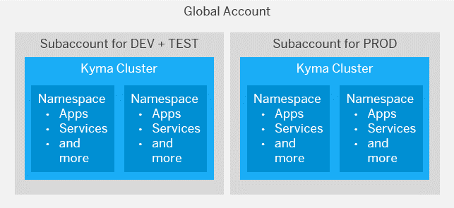

<!-- loioec8a269c4312416dbb83deb9e5b6bc5b -->

# Staged Development with the Kyma Environment

While creating a staged development environment is a good idea in any case, there are some considerations specific to Kyma you might want to take into account.

<a name="loioec8a269c4312416dbb83deb9e5b6bc5b__section_hcp_qqp_m1c"/>

## Recommended Development Landscape

In SAP BTP, Kyma runtime, each subaccount corresponds to provisioning one Kubernetes cluster. We recommend using at least two separate subaccounts to set up a staged development environment: one for development and testing \(separated by using different namespaces\), and one for production.

Within those clusters, set up namespaces according to your projects or organizational setup, such as for Sales and Logistics. For details, see [Sharing Clusters in Kyma](sharing-clusters-in-kyma-57ec1ea.md).

> ### Tip:  
> Ideally, you use a separate third cluster for testing. However, if cost-efficiency is important, one subaccount may be enough.

When you enable the Kyma environment in one of your subaccounts, the system automatically creates a Kubernetes cluster equipped with the latest version of the open-source project "Kyma" for you. The subaccount and the Kyma cluster have a 1:1 relationship. You can create namespaces within that Kyma cluster. Namespaces let you further break down your account model and use services and functions in the Kyma environment. For more information, see the Kubernetes documentation at [https://kubernetes.io/docs/concepts/overview/working-with-objects/namespaces/](https://kubernetes.io/docs/concepts/overview/working-with-objects/namespaces/).

Typically, some additional systems are also part of the landscape:

-   Identity provider, like SAP Cloud Identity Services. For details, see [Configure a Custom Identity Provider for Kyma](https://help.sap.com/viewer/65de2977205c403bbc107264b8eccf4b/Cloud/en-US/67bcc6e2d4d749659faf3ede1853f19e.html "Enable the Kyma environment with a custom identity provider (IdP).") :arrow_upper_right:.

-   Pipeline system, like [SAP Continuous Integration and Delivery](https://help.sap.com/docs/CONTINUOUS_DELIVERY).

-   SAP BTP service instances, for example, SAP HANA, SAP Audit Log, or SAP Destination service.

<a name="loioec8a269c4312416dbb83deb9e5b6bc5b__section_ah2_dqp_m1c"/>

## Considerations for Creating Subaccounts or Namespaces

When you're setting up a staged development environment in SAP BTP, Kyma runtime, you must decide if you should create different subaccounts \(and with that, different clusters\) or namespaces within one cluster. You can use both to develop applications and to use services, but generally, subaccounts are for isolation, while namespaces are for structuring.

Consider the following aspects about segregation:

-   In regard to tenant isolation, think of a subaccount as a tenant: Segregation for data access, data visibility, network connectivity, and ingress traffic happens on subaccount level, not on the application or Kyma namespace level.

-   In general, we recommend that you create at least two different subaccounts for a staged development environment. This allows for dedicated user management between the different stages \(see [Configure a Custom Identity Provider for Kyma](https://help.sap.com/viewer/65de2977205c403bbc107264b8eccf4b/Cloud/en-US/67bcc6e2d4d749659faf3ede1853f19e.html "Enable the Kyma environment with a custom identity provider (IdP).") :arrow_upper_right: and [Role-Based Access Control \(RBAC\) in Kyma](role-based-access-control-rbac-in-kyma-bb31080.md)\), as well as for dedicated data management in elastic services, such as SAP HANA Cloud.

-   Within each subaccount \(that is, Kyma cluster\), you can then create dedicated namespaces for each application, extension, solution, team, or other project within these subaccounts.

-   We recommend mounting the Secret of the service binding as a volume. When using the service binding mechanism with volume mounts, applications can consume services only within their own namespace.

Consider the following aspects about billing:

-   Provisioning a Kyma cluster isn't free of cost. Use subaccounts only if you need them for segregation, not just for structuring purposes.

-   You can monitor the consumption of resources in your global account only per directory or subaccount \(Kyma cluster\), not per namespace or application. To monitor the resources consumed by a specific project, department, or application, create a dedicated subaccount for them.

-   Accurate billing is only possible for global accounts. For the consumption-based model, you can calculate costs according to usage, but note that this is only approximate. See [Monitoring Usage and Consumption Costs in Your Global Account](https://help.sap.com/viewer/65de2977205c403bbc107264b8eccf4b/Cloud/en-US/de6f0db8919f4e6f97e54bc4ddaf2ab8.html "SAP BTP cockpit supports advanced usage and cost monitoring of services in your global account. You can compare the usage and costs of multiple services and subaccounts, see monthly trends, and drill into subaccounts and service plans for detailed information.") :arrow_upper_right: and [https://kyma-project.github.io/price-calculator/](https://kyma-project.github.io/price-calculator/).

To decide whether to create separate subaccounts or separate namespaces within the same subaccount, consider the different configuration possibilities available for subaccounts and namespaces:

<table>
<tr>
<th valign="top">

Configuration

</th>
<th valign="top">

Subaccount

</th>
<th valign="top">

Namespace

</th>
</tr>
<tr>
<td valign="top">

Configure your own group of business users

</td>
<td valign="top">

Yes

</td>
<td valign="top">

Yes

</td>
</tr>
<tr>
<td valign="top">

Configure a Cloud Connector tunnel

</td>
<td valign="top">

Yes

</td>
<td valign="top">

No

</td>
</tr>
<tr>
<td valign="top">

Configure roles and trust

</td>
<td valign="top">

Yes

</td>
<td valign="top">

Yes

</td>
</tr>
<tr>
<td valign="top">

Assign quotas

</td>
<td valign="top">

Yes \(mandatory\)

</td>
<td valign="top">

No, but you can set limits for resource consumption on namespace level.

</td>
</tr>
</table>

**Related Information**  

[Configure a Custom Identity Provider for Kyma](https://help.sap.com/viewer/65de2977205c403bbc107264b8eccf4b/Cloud/en-US/67bcc6e2d4d749659faf3ede1853f19e.html "Enable the Kyma environment with a custom identity provider (IdP).") :arrow_upper_right:

[Role-Based Access Control \(RBAC\) in Kyma](role-based-access-control-rbac-in-kyma-bb31080.md "Assigning permissions in Kyma is based on the Kubernetes role-based access control (RBAC). It’s recommended that you start with separating the developers and operators of a cluster. Later, you can refine the role concept as required.")

