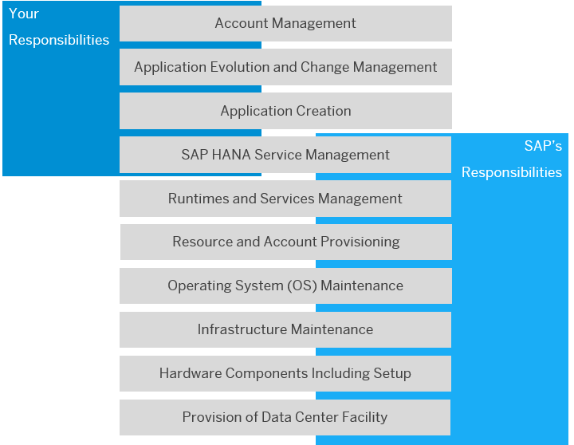

<!-- loio898509dd6f1346448d5057f4dc6b8b30 -->

# Shared Responsibility Model Between You and SAP

A shared responsibility model applies to SAP BTP: SAP manages the platform, whereas you develop and manage applications.

  
  
**Shared Responsibilities Between You and SAP**

<a name="loio898509dd6f1346448d5057f4dc6b8b30__section_yhq_pxx_32b"/>

## SAP's Responsibilities

SAP is responsible for operating the overall infrastructure of SAP BTP, including monitoring, patching, applying software updates, and maintaining the infrastructure and underlying operating systems. SAP is also responsible for technical operations such as monitoring SAP BTP services, providing health check services, managing capacity, performing troubleshooting and housekeeping, implementing regular updates, and managing incidents.

SAP creates your global account and provides you with the resources and services you've purchased.

Finally, SAP is responsible for SAP HANA database platform operations, including hardware configuration management, backup and recovery, space management, security management, and providing SAP HANA data center service point revisions as self-service update options.

<a name="loio898509dd6f1346448d5057f4dc6b8b30__section_dcf_zxx_32b"/>

## Your Responsibilities

As an SAP BTP customer, you must manage your global account and any subaccounts; that is, you are responsible for coming up with an account concept, creating and configuring your subaccounts based on the requirements of your development projects, and for distributing resources and services accordingly.

In addition, it's up to you to develop and operate applications. You are responsible for creating and deploying applications, managing application-specifc role assignments, integrating with existing systems and applications, monitoring and implementing health checks, and performing housekeeping, troubleshooting, and regular updates for your applications that are running on SAP BTP.

If you're using the SAP HANA service, you're required to trigger updates of SAP HANA revisions when applicable, using a self-service from SAP BTP.

For a more granular overview of the responsibilities for operating SAP BTP, see [Operating Model](https://help.sap.com/viewer/65de2977205c403bbc107264b8eccf4b/Cloud/en-US/9aafc94077c0447c88e2f5f2024a9c8e.html "An operating model clearly defines the separation of tasks between SAP and the customer during all phases of an integration project.") :arrow_upper_right:.

